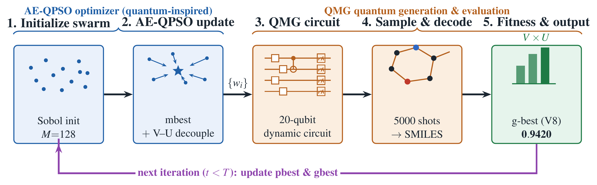
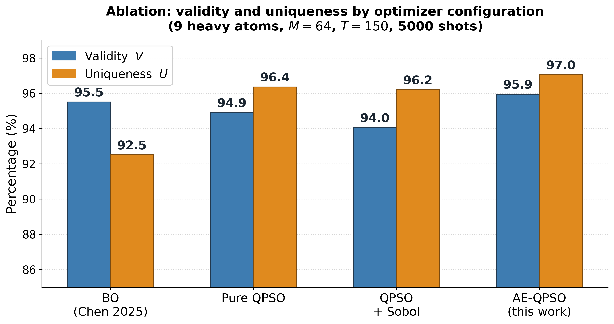
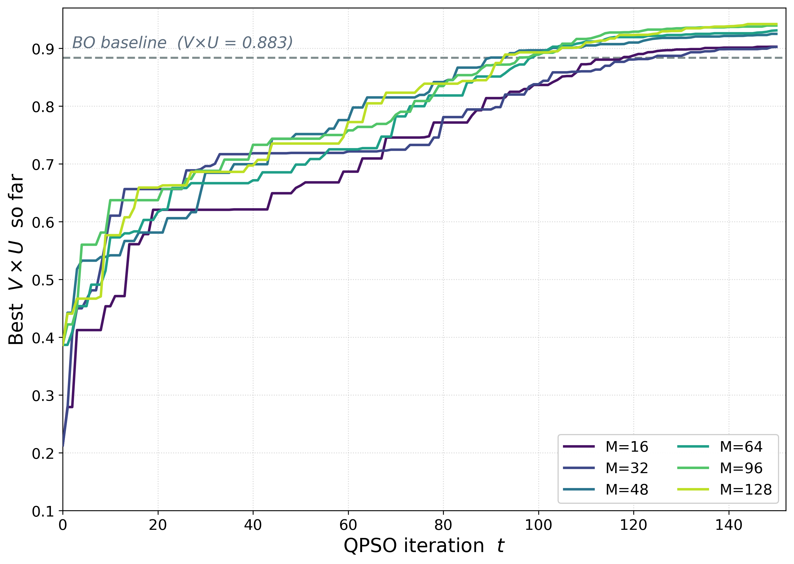
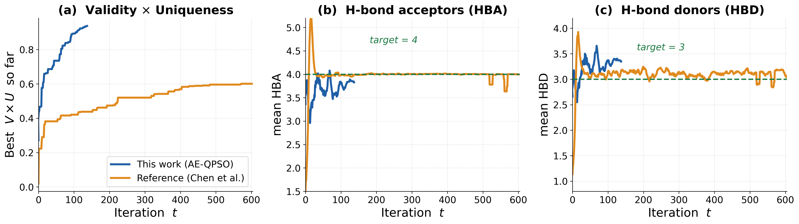

# sqmg_project-cudaq

CUDA-Q 0.7.1 implementation of QMG (Quantum Molecular Generation) with
AE-QPSO optimization, targeting 9-heavy-atom molecule generation on
NCHC DGX111 V100 GPUs.

---

## Research Goal

Surpass the Bayesian Optimization (BO) baseline reported in Chen et al. 2025
(JCTC) for 9-heavy-atom unconditional QMG:

```
Target metric : V × U (validity × uniqueness) > 0.8834
Paper baseline: V = 0.955, U = 0.925, V × U = 0.8834  (num_sample = 5 000, ~355 BO evaluations)
Achieved (V8) : V = 0.9594, U = 0.9704, V × U = 0.9310  (AE-QPSO, M=64, T=150 — +0.0476)
```

The BO optimizer is replaced with a custom **AE-QPSO** (Adaptive Ensemble
Stochastic Optimal Quantum PSO), integrating three papers:

| Paper | Role |
|---|---|
| Chen et al. 2025 (JCTC) | 20-qubit dynamic circuit, QMG framework, 134 params |
| Xiao et al. 2026 (arXiv:2604.13877v1) | SQMG — TensorNet scalability reference |
| Tseng et al. 2024 (arXiv:2311.12867v2) | AE-QTS — U-shaped harmonic weighting & paired update |

> **Status — surpassed.** The latest completed run **V8** reaches gbest **V×U = 0.9310**
> (V = 0.9594, U = 0.9704; V★ = 1.000, U★ = 0.9867), beating the BO baseline by **+0.0476**.
>
> **Best unconditional result.** Scaling the full method to **M=128** reaches
> **V×U = 0.9420** (V = 0.975, U = 0.966), beating the BO baseline (0.8834) by **+0.0586**.
>
> **Current work — HBA/HBD generation.** The pipeline now supports two H-bond
> (HBA/HBD) modes: (i) an opt-in *measure-only* channel that records mean HBA/HBD
> without changing the objective, and (ii) a *multi-objective* runner that folds
> HBA/HBD into the fitness. Multi-objective runs for M=16/32/64/128 (target HBA=4,
> HBD=3, 10 000 shots, T=150) are executing across DGX nodes dgx101/104/105/107.
> See [HBA/HBD Generation](#hbahbd-generation).

---

## Experiment History

| Run | M | T | num_sample | Init | OBL | VU-dec | AE-QTS | gbest V×U | Notes |
|---|---|---|---|---|---|---|---|---|---|
| V3 | 56 | 120 | 10 000 | random seed=42 | ✗ | ✗ | ✓ | 0.8849 | early best; num_sample=10k uniqueness bias |
| V4 | 56 | 200 | 10 000 | random seed=42 | ✗ | ✗ | ✓ | 0.8720 | α_max=0.8 too restrictive |
| V5 | 56 | 160 | 10 000 | random seed=17 | ✗ | ✗ | ✓ | 0.8589 | bad seed; stagnation never triggered |
| V6 | 64 | 120 | 5 000 | Sobol | ✓ | ✓ | ✓ | 0.8462 | first Sobol+OBL+VU run; under baseline |
| V7 | 64 | 120 | 5 000 | Sobol | ✓ | ✓ | ✓ | 0.8894 | signed-mbest fix; just above baseline |
| **V8** | **64** | **150** | **5 000** | **Sobol** | **✓** | **✓** | **✓** | **0.9310** | **best: V=0.9594, U=0.9704, V★=1.000, U★=0.9867** |

Key lessons learned:

- `num_sample = 10 000` vs the paper's `5 000` introduces a systematic
  uniqueness bias. Birthday-paradox analysis gives K ≈ 84 972 distinct
  valid molecules; switching to `5 000` raises theoretical U from 0.947 to
  0.973, lifting V×U by ≈ +0.024.
- Pseudo-random initialization is highly seed-dependent in 134D space.
  Sobol scrambled sequences provide deterministic, low-discrepancy coverage
  and eliminate lucky-seed variance entirely.
- `alpha_max` must stay at 1.2 for adequate exploration; reducing it to 0.8
  caused premature convergence (V4).
- `stagnation_limit = 12` with `mutation_prob = 0.15` is the right balance;
  Cauchy mutation must not suppress reinitialization by constantly producing
  micro-improvements inside the same basin.

### Early Experiment Signal (2026-04-24, aborted at iteration 2)

The optimizer converged rapidly before OOM terminated the run:

| Stage | gbest V×U | V★ ever | U★ ever |
|---|---|---|---|
| Phase 0 done | 0.1548 | 0.996 | 0.254 |
| Iter 1 done | 0.3422 | 0.996 | 0.566 |
| Iter 2 done | 0.4104 | 0.996 | 0.909 |

V★ = 0.996 × U★ = 0.909 ≈ **0.905 — above the baseline** was reached in
individual particles by iteration 2. The infrastructure failure (MPI
serialization + OOM) was the only blocker. Both issues are resolved in
v10.1 / v1.3.

---

## Hardware and Environment

### Cluster

```
Host   : DGX111 (NCHC)
GPU    : 8 × V100-SXM2-16GB  (Volta, sm_70, CC 7.0)
CUDA   : Driver 535.183.01, Toolkit 12.2
```

### Conda Environment (mandatory)

```bash
conda activate cudaq-v071   # Python 3.10
```

Hard constraints — **do not change**:

| Package | Version | Reason |
|---|---|---|
| `cuda-quantum-cu12` | **== 0.7.1** | Only version with sm_70 SASS; newer wheels silently fall back to CPU |
| `numpy` | `>= 1.24, < 2.0` | CUDA-Q 0.7.x incompatible with NumPy 2.x |
| `rdkit` | `>= 2023.9.5` | Required for SMILES validation |
| `scipy` | any recent | Required for Sobol initialization (v10.2+) |

Install:

```bash
pip install cuda-quantum-cu12==0.7.1
pip install "numpy>=1.24,<2.0" rdkit pandas matplotlib scikit-learn
pip install scipy --break-system-packages   # if missing
```

Verify environment:

```bash
python --version          # 3.10.x
python -c "import cudaq; print(cudaq.__version__)"   # 0.7.1.x
python -c "import numpy;  print(numpy.__version__)"  # < 2.0
python -c "from scipy.stats import qmc; print('scipy OK')"
```

---

## Repository Layout

```
sqmg_project-cudaq/
│
├── run_qpso_qmg_cudaq.py      ← PRIMARY entry point  (v10.4, +opt-in HBA/HBD measure-only)
├── qpso_optimizer_ae.py       ← AE-QPSO optimizer   (v1.5, signed-mbest + recycle)
├── worker_eval.py             ← Subprocess worker     (v10.2, tensornet blocked)
├── qpso_optimizer_qmg.py      ← Legacy SOQPSO         (reference only)
├── run_qpso_qmg_mpi.py        ← MPI fallback          (v1.3, deadlock fix)
├── cutn-qmg_mpi_8g.slurm      ← SLURM script          (v1.2, --gpu-bind fix)
├── run_sweep.sh               ← Fig 3 particle-count sweep driver
├── run_m128_hbahbd.sh         ← M=128 HBA/HBD measure-only launcher  (v10.4)
├── run_qpso_qmg_cudaq_hbahbd_multiobj.py ← HBA/HBD MULTI-OBJECTIVE runner  (NEW)
├── run_hbahbd_multiobj.sh     ← multi-objective launcher: `bash run_hbahbd_multiobj.sh <M>`  (NEW)
│
├── qmg/
│   ├── __init__.py
│   ├── generator_cudaq.py     ← MoleculeGeneratorCUDAQ  (v10.0)
│   └── utils/
│       ├── __init__.py
│       ├── build_dynamic_circuit_cudaq.py  ← _qmg_n9 kernel  (v9.2, valence-aware bonds)
│       ├── chemistry_data_processing.py    ← MoleculeQuantumStateGenerator
│       ├── fitness_calculator.py           ← V/U scoring
│       └── weight_generator.py             ← ConditionalWeightsGenerator
│
├── figures/
│   ├── fig1_flowchart.py       ← Fig 1 method flowchart generator
│   ├── fig1_workflow.tex       ← Fig 1 LaTeX/TikZ source
│   ├── make_figs_v2.py         ← Fig 2/3 generators (on DGX; reads result CSVs)
│   ├── make_fig4.py            ← Fig 4 generator (HBA/HBD vs reference)
│   ├── fig1_workflow.png/.pdf  ← Fig 1 (method workflow, horizontal)
│   ├── fig2_VU_bars.png/.pdf   ← Fig 2 (optimizer ablation)
│   ├── fig3_convergence.png/.pdf ← Fig 3 (convergence vs particle count)
│   └── fig4_hbahbd_compare.png/.pdf ← Fig 4 (HBA/HBD vs reference)
│
├── docs/
│   ├── qmg-soqpso-handoff-2026-05-07.md   ← Full runbook
│   └── hbahbd_measurement_v10.4_handoff.md ← v10.4 HBA/HBD measure-only handoff
│
├── requirements.txt
└── .gitignore
```

---

## Architecture

### Call Graph

```
run_qpso_qmg_cudaq.py  (main process, stable RSS < 1 GB)
│
├─ ConditionalWeightsGenerator          # generates / constrains 134 float weights
│
└─ AESOQPSOOptimizer (qpso_optimizer_ae.py v1.5)
    │  M=64 particles, T=150 iterations, D=134 dimensions
    │  AE-QTS U-shaped harmonic mbest + V-U decoupled mbest
    │  OBL Phase 0 (doubles effective initial coverage)
    │  paired attractor update every pair_interval iterations
    │
    └─ batch_evaluate_fn  (parallel subprocess pool)
        │  Each QPSO iteration launches ⌈M/N_GPUS⌉ rounds.
        │  Each round: N_GPUS=8 subprocesses launched simultaneously.
        │
        └─ [subprocess × 8 in parallel]  worker_eval.py
                CUDA_VISIBLE_DEVICES set by parent before Popen()
                → CUDA context initialized to one dedicated GPU
                │
                └─ MoleculeGeneratorCUDAQ (generator_cudaq.py v10.0)
                    │  chemistry_constraint=False (already applied by parent)
                    │
                    ├─ cudaq.sample(_qmg_n9, w_list, shots_count=5000)
                    │   20-qubit dynamic circuit
                    │   90 named mid-circuit measurements
                    │   134 float weights
                    │
                    └─ _reconstruct_bitstrings_n9()
                        90 named registers → bitstrings
                        → SMILES via MoleculeQuantumStateGenerator
                        → validity, uniqueness
```

### Why subprocess pool (not MPI)

Two compounding failures were diagnosed in the 2026-04-24 MPI experiment:

**Failure 1 — MPI serialization.** NCHC SLURM uses cgroup v2 for GPU
isolation. Without `--gpu-bind=per_task:1`, all 8 MPI ranks were mapped
to a single physical GPU. Even with correct cgroup binding, CUDA-Q 0.7.1's
cuStateVec backend acquires a node-wide serialization lock through
`/dev/nvidia-ctl` during `cudaq.sample()`, causing all ranks to execute
sequentially: measured 6129 s for 50 particles vs. an expected 858 s.

**Failure 2 — cudaMallocHost pinned memory leak.** CUDA-Q 0.7.1 allocates
approximately 2.5 GB of pinned memory per `cudaq.sample()` call via
`cudaMallocHost`. This memory is managed by the CUDA driver, not the process
heap; `del`, `gc.collect()`, and `malloc_trim(0)` are all ineffective. The
only release mechanism is CUDA context destruction, which is triggered only
when the process exits. Long-lived MPI ranks accumulate ~500 GB of pinned
memory across 4 batches of 50 particles before the kernel OOM-kills them.

**v10.1 solution.** Each call to `batch_evaluate_fn` spawns fresh subprocesses.
The parent sets `CUDA_VISIBLE_DEVICES=<gpu_id>` in the child's environment
before `Popen()` — before any CUDA initialization — so the child sees exactly
one GPU regardless of cgroup policy. When the child exits after a single
`cudaq.sample()`, the CUDA driver destroys the context and reclaims all
pinned memory. Peak concurrent pinned memory is bounded to 8 × 2.5 GB = 20 GB.

### AE-QPSO Algorithm

**v1.1 bug corrections** (verified against arXiv:2311.12867v2):

**Bug 1 — mbest weighting.** v1.0 used monotonically decreasing weights
`w_k = 1/(k+1)` favoring only top-ranked particles. The paper's AE-QTS
Algorithm 3 applies rotation magnitude `Δθ/k` to both `best_k` and
`worst_k`, producing a **U-shaped** weight profile: high influence at both
ends, minimum in the middle. v1.1 implements symmetric harmonic weighting:
rank `k` and rank `M+1-k` each contribute `1/k`.

**Bug 2 — paired update direction.** v1.0 moved `worst_k` with Cauchy
perturbation (random exploration). The paper applies amplitude amplification
to both `best_k` and `worst_k` — both move toward their local attractor
`φ·pbest + (1-φ)·gbest` with step `rotate_factor/k`. Cauchy mutation is a
separate SOQPSO mechanism applied in the main loop; it does not belong inside
the AE pairing step.

---

## Version v10.3 / v1.5 / v9.2 Changes (V8 — current best)

**V8 additions** (over V6/V7): `T` 120→150; `alpha_min` 0.40→0.30; `pair_interval` 5→4;
AE-QTS **signed-harmonic mbest** sign-error fix (directional displacement 0.010→0.029);
**mode-collapse recycling**; **adaptive V–U weighting** with tracking gates;
**valence-aware bond-disconnection correction**. Result: gbest **V×U = 0.9310**
(V8) vs 0.8462 (V6) / 0.8894 (V7).

The four v10.2 building blocks below remain active, relative to the V3 run (v10.1 / v1.1):

### 1 — `num_sample = 5 000` (most impactful)

Birthday-paradox analysis on V3 gbest data shows K ≈ 84 972 distinct valid
molecules. Expected uniqueness at n=5 000 is 0.973 vs 0.947 at n=10 000,
giving +0.024 on V×U with no algorithm change. Also aligns with Chen 2025
for a fair comparison. Side effect: each subprocess evaluation drops from
~284 s to ~142 s, halving total wall time.

### 2 — Sobol scrambled initialization (`--sobol_init`, default on)

Replaces pseudo-random particle positions with Owen-scrambled Sobol sequences
(`scipy.stats.qmc.Sobol(d=134, scramble=True, seed=0)`). Benefits:

- Deterministic and reproducible — no lucky-seed dependence
- Guaranteed low discrepancy across all 134 dimensions
- ~20% lower discrepancy vs random (measured: 1.20e-11 vs 1.51e-11)
- `M = 64 = 2^6` satisfies Sobol's power-of-two requirement

### 3 — Opposition-Based Learning Phase 0 (`--obl`, default on)

After the standard Phase 0 evaluation of M particles, evaluates M
"opposition particles" `x' = clip(1 − x, 0, 1)`. Whichever of (x, x') has
higher fitness becomes the initial particle. Effective coverage doubles with
only one extra batch. Only active in batch (multi-GPU) mode.

Reference: Tizhoosh, H.R., *Opposition-Based Learning*, ISDA 2005.

### 4 — V-U Decoupled mbest (`--vu_decouple`, default on)

The standard AE-QTS U-shaped harmonic mbest is augmented with explicit
pulls toward the best-V-ever position and best-U-ever position:

```
mbest = (w_vu × mbest_standard + w_v × best_v_pos + w_u × best_u_pos)
        / (w_vu + w_v + w_u)
```

Default weights: `w_vu=0.70, w_v=0.15, w_u=0.15`. This addresses the
joint-optimum problem where V★=1.000 and U★=0.986 are achieved by different
particles that never converge into a single high-V×U solution.

---

## Key Parameters

| Parameter | Value | Notes |
|---|---|---|
| `num_heavy_atom` | 9 | 20-qubit circuit, 134 float params |
| `num_sample` | 5000 | shots per `cudaq.sample()`; matches Chen 2025 |
| `particles (M)` | 64 | `= 2^6` for Sobol uniformity guarantee |
| `iterations (T)` | 150 | `total_evals ≈ 64 × 151 + 64 (OBL) = 9728` |
| `n_gpus` | 8 | subprocess pool width |
| `alpha_max / min` | 1.2 / 0.4 | cosine annealing bounds |
| `mutation_prob` | 0.15 | Cauchy heavy-tail mutation rate |
| `stagnation_limit` | 12 | iterations before reinit triggers |
| `reinit_fraction` | 0.25 | fraction of worst particles replaced |
| `ae_weighting` | True | U-shaped harmonic mbest (v1.1 fix) |
| `pair_interval` | 5 | AE paired update every N QPSO iterations |
| `rotate_factor` | 0.015 | paired update step `Δθ/k` scaling |
| `obl` | True | OBL Phase 0 (v1.2) |
| `vu_decouple` | True | V-U decoupled mbest (v1.2) |
| `w_vu / w_v / w_u` | 0.70 / 0.15 / 0.15 | VU-decouple mbest weights |

---

## Quick Debug Flow

```bash
cd ~/sqmg_project-cudaq
git pull origin main

# 1. Import check
python -c "
import cudaq, numpy as np
from scipy.stats import qmc
from qmg.utils import ConditionalWeightsGenerator
from qpso_optimizer_ae import AESOQPSOOptimizer
print('imports OK | cudaq', cudaq.__version__, '| numpy', np.__version__)
"

# 2. Sobol check
python -c "
from scipy.stats import qmc
s = qmc.Sobol(d=134, scramble=True, seed=0)
p = s.random(n=64)
print('Sobol OK | shape', p.shape, '| disc', qmc.discrepancy(p))
"

# 3. Single-GPU worker smoke test
python -c "
import numpy as np
from qmg.utils import ConditionalWeightsGenerator
cwg = ConditionalWeightsGenerator(9, smarts=None)
w = cwg.generate_conditional_random_weights(random_seed=42)
np.save('/tmp/smoke_w.npy', w)
print('weight len =', len(w))   # must be 134
"

CUDA_VISIBLE_DEVICES=0 python worker_eval.py \
    --weight_path /tmp/smoke_w.npy \
    --result_path /tmp/smoke_r.npy \
    --num_heavy_atom 9 --num_sample 100 --backend cudaq_nvidia

python -c "
import numpy as np
r = np.load('/tmp/smoke_r.npy')
print(f'V={r[0]:.3f}  U={r[1]:.3f}')
assert r[0] > 0, 'V=0, GPU not working'
print('worker_eval single-GPU OK')
"
```

---

## Sanity Check (multi-GPU, ~5 min)

```bash
python run_qpso_qmg_cudaq.py \
    --backend        cudaq_nvidia         \
    --num_sample     100                  \
    --particles      8                    \
    --iterations     1                    \
    --n_gpus         8                    \
    --gpu_ids        0,1,2,3,4,5,6,7     \
    --subprocess_timeout 120              \
    --sobol_init                          \
    --obl                                 \
    --vu_decouple                         \
    --task_name      sanity_v6            \
    --data_dir       results_sanity_v6
```

Expected log lines confirming v10.2 features are active:

```
[Sobol v10.2] 初始化完成  n=8  d=134  discrepancy=...
[OBL v1.2] Phase 0 對立粒子評估（8 個對立位置）...
[OBL v1.2] 完成（...s），替換 N/8 個粒子，gbest=...
[AE-QPSO v1.2 Iter   1/1] α=...
```

Verify parallelism by watching GPU utilization during the test:

```bash
# DO NOT use "watch -n 5 nvidia-smi" on DGX111 — it causes segfault
while true; do clear; nvidia-smi; sleep 10; done
```

All 8 GPUs should show GPU-Util > 80% simultaneously during each round.

---

## Full V6 Experiment

Run inside a tmux session to survive SSH disconnects:

```bash
tmux new -s qmg_v6
conda activate cudaq-v071
cd ~/sqmg_project-cudaq
git pull origin main

python run_qpso_qmg_cudaq.py \
    --backend             cudaq_nvidia                      \
    --num_heavy_atom      9                                 \
    --num_sample          5000                              \
    --particles           64                                \
    --iterations          120                               \
    --n_gpus              8                                 \
    --gpu_ids             0,1,2,3,4,5,6,7                  \
    --subprocess_timeout  360                               \
    --sobol_init                                            \
    --obl                                                   \
    --vu_decouple                                           \
    --w_vu                0.70                              \
    --w_v                 0.15                              \
    --w_u                 0.15                              \
    --alpha_max           1.2                               \
    --alpha_min           0.4                               \
    --mutation_prob       0.15                              \
    --stagnation_limit    12                                \
    --reinit_fraction     0.25                              \
    --ae_weighting                                          \
    --pair_interval       5                                 \
    --rotate_factor       0.015                             \
    --seed                0                                 \
    --task_name           unconditional_9_ae_v6_sobol_obl  \
    --data_dir            results_v6
```

### Timing estimate (V100 × 8, num_sample=5 000)

```
Single evaluation  :  ~142 s  (5 000 shots, cudaq_nvidia)
Rounds per iter    :  ⌈64/8⌉ = 8 rounds
Time per iter      :  8 × 142 s ≈ 1 136 s  (≈ 19 min)
Phase 0 + OBL      :  2 batches × 1 136 s  ≈ 38 min
Full run T=120     :  122 batches × 1 136 s ≈ 38.5 h
Total evals        :  64 × 121 + 64 (OBL) = 7 808
```

### Output files

```
results_v6/
├── unconditional_9_ae_v6_sobol_obl.log
├── unconditional_9_ae_v6_sobol_obl.csv
└── unconditional_9_ae_v6_sobol_obl_best_params.npy
```

---

## Monitoring

```bash
# GPU utilization — DO NOT use `watch -n 5 nvidia-smi` on DGX111 (causes segfault)
while true; do clear; nvidia-smi; sleep 10; done

# Follow log
tail -f results_v6/unconditional_9_ae_v6_sobol_obl.log

# Check current best
grep "🔥 New gbest" results_v6/unconditional_9_ae_v6_sobol_obl.log | tail -5

# Iteration summary
grep "AE-QPSO v1.2 Iter" results_v6/unconditional_9_ae_v6_sobol_obl.log | tail -20

# Verify parallelism: each round should complete in ~130–160 s
grep "parallel 輪次" results_v6/unconditional_9_ae_v6_sobol_obl.log | head -20

# Memory stability check (main process should stay < 600 MB throughout)
grep "\[MEM\]" results_v6/unconditional_9_ae_v6_sobol_obl.log | tail -10
```

---

## Reproduce Best Result (V3)

```bash
python -c "
import numpy as np
from qmg.utils import ConditionalWeightsGenerator
from qmg.generator_cudaq import MoleculeGeneratorCUDAQ

best_w = np.load('results_v3/unconditional_9_ae_v3_M56T120_best_params.npy')
cwg    = ConditionalWeightsGenerator(9, smarts=None)
w_c    = cwg.apply_chemistry_constraint(best_w.copy())

gen = MoleculeGeneratorCUDAQ(9, all_weight_vector=w_c, backend_name='cudaq_nvidia')
sd, v, u = gen.sample_molecule(5000)   # use 5000 to match Chen 2025
print(f'V={v:.4f}  U={u:.4f}  V×U={v*u:.6f}')
valid = [k for k in sd if k and k != 'None']
print(f'Unique valid SMILES: {len(valid)}')
for smi in valid[:10]:
    print(' ', smi)
"
```

---

## MPI Fallback (run_qpso_qmg_mpi.py v1.3)

Use **only** if the cluster admin confirms `--gpu-bind=per_task:1` is supported
and the cuStateVec serialization lock has been addressed.

**v1.3 fixes a deadlock** introduced in v1.2: `_COMM.Barrier()` inside
`batch_evaluate_fn` (called only by rank 0) conflicted with non-rank-0's
`_COMM.bcast(flag)`, causing a permanent hang whenever `reinit_every`
triggered. v1.3 folds the rebuild signal into the existing flag bcast as
`_MPI_FLAG_REBUILD = 2`, eliminating the independent barrier entirely.

Verify GPU binding before submitting:

```bash
srun --nodes=1 --ntasks-per-node=8 --gres=gpu:8 --gpu-bind=per_task:1 \
    bash -c 'echo "rank $PMI_RANK: SLURM_LOCALID=$SLURM_LOCALID SLURM_STEP_GPUS=$SLURM_STEP_GPUS"'
# Each rank must show a distinct SLURM_STEP_GPUS value.
```

Submit:

```bash
sbatch cutn-qmg_mpi_8g.slurm
tail -f results_mpi_v12/unconditional_9_ae_mpi_v12.log
```

---

## Known Issues and Constraints

| Issue | Constraint / Workaround |
|---|---|
| `watch -n 5 nvidia-smi` segfaults on DGX111 | Use `while true; do clear; nvidia-smi; sleep 10; done` |
| `@cudaq.kernel` tests fail with `python -c` | Write to a `.py` file; CUDA-Q uses `inspect.getsource()` internally |
| `tensornet` backend hangs with dynamic circuits | **Blocked in worker_eval.py v10.2.** Never use `--backend cudaq_tensornet` |
| `list[float]` broadcast dispatch bug (CUDA-Q 0.7.1) | Fixed in `_qmg_n9` v9.1: every `mz()` assignment on its own line |
| `get_sequential_data()` returns `list[str]`, not `int` | Fixed in v9.5: use `int(bit)` not `1 if bit else 0` |
| Chemistry constraint double-application | Fixed: parent applies once; `worker_eval.py` sets `chemistry_constraint=False` |
| AE-QTS mbest monotone weighting | Fixed in `qpso_optimizer_ae.py` v1.1: U-shaped symmetric harmonic weighting |
| AE-QTS paired update Cauchy misuse | Fixed in v1.1: both `best_k` and `worst_k` move toward their local attractor |
| CUDA-Q >= 0.8 drops sm_70 SASS | Pinned to `cuda-quantum-cu12==0.7.1`; do not upgrade |
| NumPy 2.x incompatibility | Hard constraint: `numpy < 2.0` |
| Pinned memory leak (cudaMallocHost) | Subprocess pool: each worker exits after one `cudaq.sample()`, releasing all pinned memory |
| MPI serialization via `/dev/nvidia-ctl` mutex | subprocess pool is the primary path; MPI is fallback only |
| Sobol requires `M = 2^k` for full uniformity | Default `M=64 = 2^6`; non-power-of-two triggers a warning but still works |

---

## Algorithm Version History

| File | Version | Key changes |
|---|---|---|
| `qpso_optimizer_ae.py` | v1.0 | Initial AE-QPSO |
| `qpso_optimizer_ae.py` | v1.1 | Fix U-shaped weighting bug; fix paired-update Cauchy bug |
| `qpso_optimizer_ae.py` | v1.2 | OBL Phase 0; V-U decoupled mbest |
| `qpso_optimizer_ae.py` | **v1.5** | **V8: signed-harmonic mbest fix; mode-collapse recycle; adaptive V-U weight** |
| `run_qpso_qmg_cudaq.py` | v9.6 | Subprocess isolation (memory leak fix) |
| `run_qpso_qmg_cudaq.py` | v10.1 | Parallel 8-GPU subprocess pool (MPI abandoned) |
| `run_qpso_qmg_cudaq.py` | v10.2 | num_sample=5000; Sobol init; OBL; VU-decouple flags |
| `run_qpso_qmg_cudaq.py` | **v10.3** | **V8: T=150; alpha_min=0.30; pair_interval=4; V-U tracking gates** |
| `run_qpso_qmg_cudaq.py` | **v10.4** | **Opt-in HBA/HBD measure-only: `--hba_target`/`--hbd_target`, HBAHBDRecorder, reference-format log (optimization path unchanged)** |
| `run_qpso_qmg_cudaq_hbahbd_multiobj.py` | **NEW** | **HBA/HBD multi-objective: fitness `(V×U)·((1−w)+w·chem_closeness)`, `chem_closeness=exp(−½((|HBA−4|/σ)²+(|HBD−3|/σ)²))`; flags `--chem_weight`,`--hba_sigma`,`--hbd_sigma`** |
| `worker_eval.py` | v10.2 | Remove tensornet from choices; default backend fix |
| `worker_eval.py` | **v10.4** | **`compute_mean_hba_hbd()` (RDKit Lipinski); returns `[V,U,HBA,HBD]` (parent still reads V,U — backward compatible)** |
| `qmg/generator_cudaq.py` | v10.0 | TensorNet backend stubs; malloc_trim |
| `qmg/utils/build_dynamic_circuit_cudaq.py` | v9.1 | Semicolon AST fix; parametric kernel |
| `qmg/utils/build_dynamic_circuit_cudaq.py` | **v9.2** | **V8: valence-aware bond-disconnection correction** |
| `run_qpso_qmg_mpi.py` | v1.3 | Fix Barrier deadlock via MPI_FLAG_REBUILD |

---

## Paper Figures & Comparison Runs

Four figures are produced for the paper. Generators and rendered figures live in `figures/`.

| Figure | Content | Generator | Data source |
|---|---|---|---|
| Fig 1 | Method workflow (horizontal, quantum–classical hybrid) | `figures/fig1_workflow.tex` | none (design) |
| Fig 2 | Optimizer ablation (BO / pure QPSO / +Sobol / AE-QPSO), V and U | `figures/make_figs_v2.py` | `results_qpso_nosobol/`, `results_qpso_pure/`, `results_v8/` |
| Fig 3 | Convergence of best V×U vs iteration for M=16…128 | `figures/make_figs_v2.py` | `results_sweep_M*/` + `results_v8/` |
| Fig 4 | Conditional HBA/HBD vs reference: V×U, HBA, HBD per iteration | `figures/make_fig4.py` | `results_hbahbd/` + reference log |

### Fig 1 — Method Workflow


### Fig 2 — Optimizer Ablation


### Fig 3 — Convergence vs Particle Count


### Fig 4 — Conditional HBA/HBD vs Reference


**Pure-QPSO ablation (Fig 2).** Here "QPSO" means the AE optimizer with *all
AE-QTS removed* — standard QPSO mean-best `mbest = mean(pbest)`. Same circuit,
Sobol init and parallel evaluation; only the amplitude-ensemble mechanism differs:

```bash
python run_qpso_qmg_cudaq.py --backend cudaq_nvidia --num_heavy_atom 9 \
    --num_sample 5000 --particles 64 --iterations 150 \
    --n_gpus 8 --gpu_ids 0,1,2,3,4,5,6,7 --subprocess_timeout 360 \
    --sobol_init --no_obl --no_vu_decouple --no_ae_weighting --pair_interval 0 \
    --seed 0 --task_name unconditional_9_qpso_pure_M64T150 --data_dir results_qpso_pure
```

**Particle-count sweep (Fig 3).** `run_sweep.sh` runs the full V8 method at
`M = 16, 32, 48, 96, 128` (M=64 reuses `results_v8/`), each full length T=150,
sequentially after the pure-QPSO run frees the GPUs.

Regenerate the data-driven figures (on DGX, reading result CSVs):

```bash
python figures/make_figs_v2.py         # -> fig2_VU_bars + fig3_convergence
python figures/make_fig4.py            # -> fig4_hbahbd_compare (needs the reference log)
```

---

## HBA/HBD Generation

Two H-bond (HBA/HBD) modes are provided, both benchmarked against an external
reference run (`chemistry_constraint_qiskit_4HBA_3HBD_0.log`, a different
optimizer/codebase targeting HBA=4, HBD=3 at 10\,000 shots, reaching V×U ≈ 0.60).

### Mode 1 — measure-only (v10.4)

The optimizer objective is unchanged (it still maximizes V×U); HBA/HBD are only
measured and logged. `worker_eval.py` adds `compute_mean_hba_hbd()` (RDKit
`Lipinski.NumHAcceptors` / `NumHDonors`, frequency-weighted) and returns
`[V, U, HBA, HBD]`; `run_qpso_qmg_cudaq.py` gains `--hba_target` / `--hbd_target`
(default off) plus an `HBAHBDRecorder` that writes `{task}_hbahbd.csv`. Launch with
`run_m128_hbahbd.sh`. Details:
[docs/hbahbd_measurement_v10.4_handoff.md](docs/hbahbd_measurement_v10.4_handoff.md).

### Mode 2 — multi-objective (current)

`run_qpso_qmg_cudaq_hbahbd_multiobj.py` folds HBA/HBD into the fitness that the
optimizer maximizes:

```
objective       = (V × U) · [ (1 − w) + w · chem_closeness ]
chem_closeness  = exp( −½ · ( (|HBA − 4| / σ_HBA)² + (|HBD − 3| / σ_HBD)² ) )
```

with defaults `--chem_weight w = 0.40`, `--hba_sigma = --hbd_sigma = 1.0`,
`--hba_target 4`, `--hbd_target 3`. When HBA=4 and HBD=3 the closeness factor is 1
and the objective reduces to V×U; deviations shrink it, so the swarm is driven
toward both high V×U and the H-bond targets. The optimizer
(`qpso_optimizer_ae.py`) receives this scorer through a `fitness_fn` hook.

**Runs (launched 2026-07-07, one M per DGX node, 8 GPUs each, tmux, 10\,000 shots,
T=150, target HBA=4 / HBD=3).**

| M | node | tmux session |
|---|---|---|
| 16 | dgx101 | `multiobj_M16` |
| 32 | dgx104 | `multiobj_M32` |
| 64 | dgx105 | `multiobj_M64` |
| 128 | dgx107 | `multiobj_M128` |

Launch (per node): `bash run_hbahbd_multiobj.sh <M>`. Outputs (gitignored; on shared
beegfs under `results_hbahbd_multiobj/`): `{task}.log` (reference-format),
`{task}_multiobj.csv`, `{task}_multiobj_best.json`, `console_multiobj_M{M}.log`.

---

## References

1. Chen, L.-Y. et al. *Exploring Chemical Space with Chemistry-Inspired
   Dynamic Quantum Circuits in the NISQ Era.* JCTC 2025.
   DOI: 10.1021/acs.jctc.5c00305
2. Xiao, Y.-C. et al. *Scalable Quantum Molecular Generation via
   GPU-Accelerated Tensor-Network Simulation.* arXiv:2604.13877v1, 2026.
3. Tseng, K.-C. et al. *Amplitude-Ensemble Quantum-Inspired Tabu Search
   Algorithm for Solving 0/1 Knapsack Problems.* arXiv:2311.12867v2, 2024.
4. Sun, J. et al. *A Global Search Strategy of Quantum-Behaved Particle
   Swarm Optimization.* CEC 2012.
5. Tizhoosh, H. R. *Opposition-Based Learning: A New Scheme for Machine
   Intelligence.* ISDA 2005.

For the complete debug runbook, infrastructure diagnosis, and recovery
procedures see
[docs/qmg-soqpso-handoff-2026-05-07.md](docs/qmg-soqpso-handoff-2026-05-07.md).