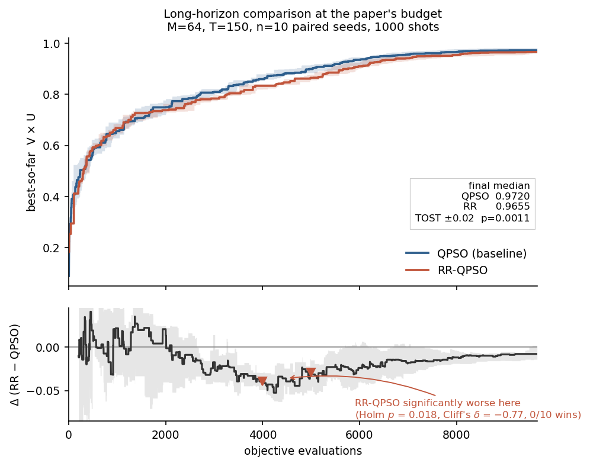
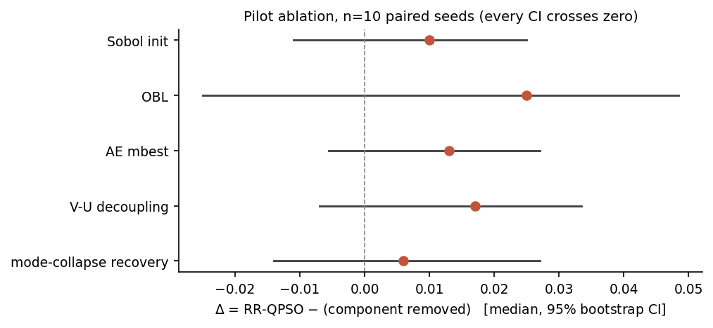
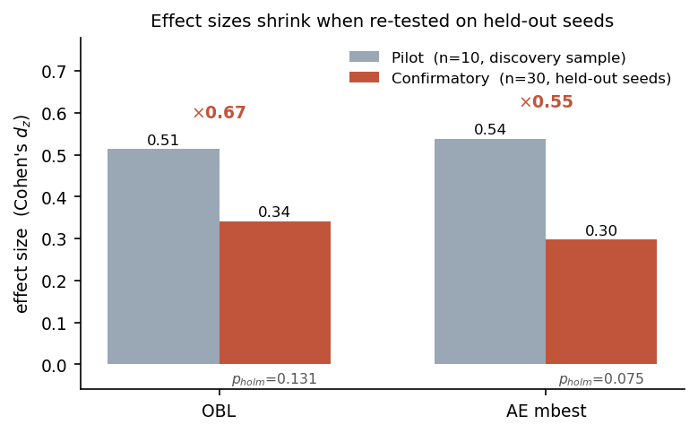
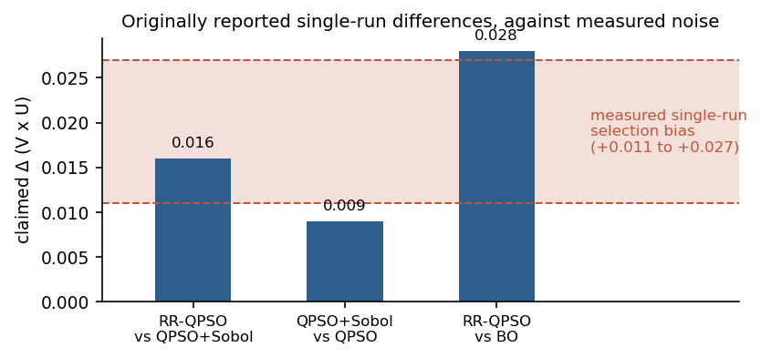
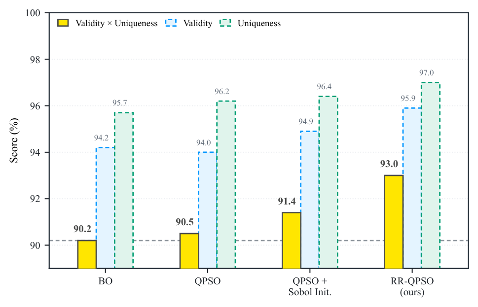
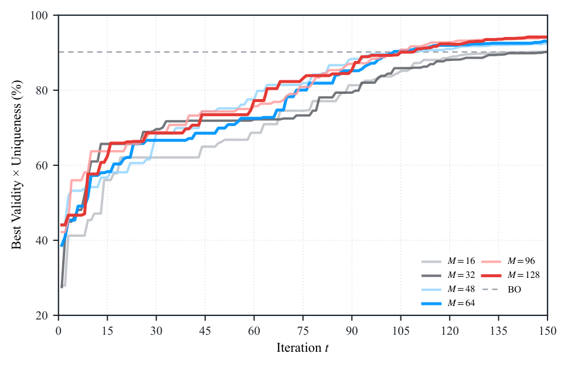
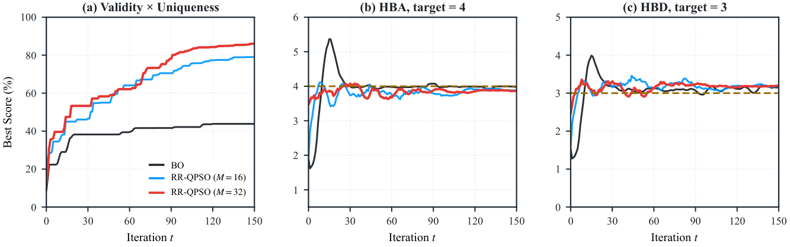
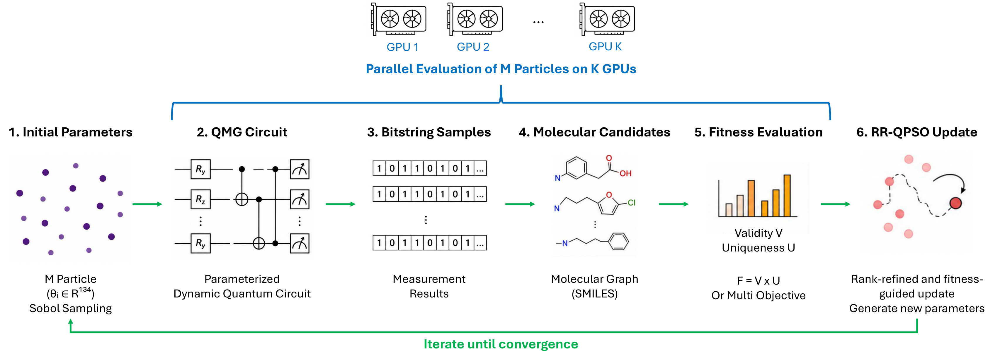

# sqmg_project-cudaq

**Rank-Refined Quantum-Behaved Particle Swarm Optimization (RR-QPSO) for Quantum
Molecular Generation (QMG).**

CUDA-Q 0.7.1 implementation of the optimizer and experiments in the paper
*Rank-Refined Quantum-Behaved Particle Swarm Optimization for Quantum Molecular
Generation* (Sing-Yun Wu, Sheng Yun Wu, I-Min Chiang, Tai-Yue Li). RR-QPSO is a
population-based replacement for Bayesian optimization (BO) in QMG parameter
search, targeting the 9-heavy-atom benchmark on NVIDIA V100 GPUs.

> With **M = 64** particles and **T = 150** iterations, RR-QPSO reaches a
> validity–uniqueness product of **V×U = 0.930**. Increasing the swarm to
> **M = 128** raises it to **V×U = 0.942**, compared with **0.902** for the
> re-run BO baseline. A multi-objective extension targeting **HBA = 4, HBD = 3**
> keeps a higher V×U than BO while steering molecular properties toward the
> target region.

---

## Overview

Quantum Molecular Generation (QMG) formulates molecule generation as a
parameterized quantum sampling problem: a chemistry-inspired *dynamic* quantum
circuit encodes sequential atom-then-bond decisions, and mid-circuit
measurements are decoded into molecular graphs. For molecules with `N` heavy
atoms the circuit is controlled by `θ ∈ R^D` with

```
D = 8 + 3(N-2)(N+3)/2
```

This project uses the **9-heavy-atom** setting, giving **D = 134** trainable
parameters on a **20-qubit** dynamic circuit. Each candidate `θ` is expensive to
score (stochastic circuit sampling → bitstring decoding → RDKit validity/
uniqueness), but candidate evaluations are mutually independent, which makes a
parallel, population-based optimizer a natural fit.

The QMG circuit and molecular decoding pipeline are **unchanged** from Chen et
al. 2025; the contribution here is entirely at the **optimizer** level.

---

## Method — RR-QPSO

The optimizer maintains a swarm of `M` particles, each a 134-D parameter vector,
and improves them over `T` iterations. Three components distinguish RR-QPSO from
standard QPSO.

**1. Sobol-based initialization.** Particles are initialized with Owen-scrambled
Sobol low-discrepancy sequences (`scipy.stats.qmc.Sobol(d=134, scramble=True)`)
for broad, deterministic coverage of the 134-D domain (no lucky-seed variance).
`M = 2^k` (e.g. 64, 128) satisfies Sobol's power-of-two uniformity guarantee.

**2. Rank-refined mean-best update.** Standard QPSO uses the plain mean of
personal-best positions as the swarm attractor. RR-QPSO sorts personal bests by
fitness and adds a rank-based correction that separates high- and low-fitness
regions:

```
m_RR = (1/M) Σ p_i  +  ρ Σ_{k=1..⌊M/2⌋} ( p_(k) − p_(M−k+1) )
```

with a fixed correction strength `ρ = 0.015` (`--rotate_factor 0.015`). This
gives a stronger population-level search signal than simple averaging.

**3. Fitness-guided refinement.** The product objective `F = V × U` can hide
different failure modes, so the attractor is blended with validity- and
uniqueness-oriented elites, each gated by its complementary metric (τ = 0.5):

```
m̃ = (w_RR·m_RR + I_V·w_V·x_V + I_U·w_U·x_U) / (w_RR + I_V·w_V + I_U·w_U)
w_RR = 0.70,  w_V = w_U = 0.15
```

The gates prevent chasing a high-validity solution that has collapsed in
diversity, or a high-uniqueness solution with poor validity.

**Particle update.** Positions follow the QPSO contraction–expansion update with
`m̃` as attractor; the coefficient `α` is annealed within `[α_min, α_max] =
[0.3, 1.2]` (broad early exploration, smaller late steps). All particles are
clipped to the valid parameter range after each update.

**Multi-GPU parallel evaluation.** At each iteration the `M` candidates are
distributed across `K` GPUs; each GPU worker runs circuit sampling, decoding and
scoring independently, then the optimizer collects the scores and performs the
RR-QPSO update.

> **Naming note.** "RR-QPSO" is the paper-level name. The implementation modules
> keep their original filenames and log tags (`qpso_optimizer_ae.py`, log prefix
> `AE-QPSO`); the algorithm is identical. The optimizer flags map to the paper as
> `--sobol_init` → Sobol init, `--rotate_factor`/`--ae_weighting` → rank-refined
> mean-best, `--vu_decouple` (`--w_vu/--w_v/--w_u`) → fitness-guided refinement.

---

## Results

> ### ⚠ Status: the optimizer comparison has been superseded
>
> The original optimizer comparison (§ "Superseded single-run results" below)
> rested on **single runs, n = 1**. A subsequent methodological study — **360 runs
> across seven experiments**, paired designs, 5–30 seeds per configuration — does
> not reproduce its central claim. Two of the three differences it reported are
> smaller than the measured shot-noise selection bias.
>
> The particle-count sweep and the multi-objective results are **not** affected
> and are retained below.
>
> Full study: [`docs/RESULTS.md`](docs/RESULTS.md) ·
> Data index: [`docs/EXPERIMENTS.md`](docs/EXPERIMENTS.md)

All figures below use the 134-parameter, 20-qubit dynamic circuit, CUDA-Q 0.7.1
(cuStateVec) on NVIDIA V100 GPUs, and report the validity–uniqueness product
`V × U`. **Shot count matters for cross-study comparison** — see the caveat at
the end of this section.

### Optimizer comparison — eight algorithms

M = 64, 9,664 objective evaluations (T = 150), 1,000 shots, n = 5 paired seeds.
Every optimizer is held to an identical evaluation budget by
`optimizers/base.py`, and every seed fixes both the optimizer RNG and the shot
RNG, so comparisons are paired.

| Rank | Optimizer | Median V×U | SD | Mean rank |
|---|---|---|---|---|
| 1 | **QPSO** | **0.9750** | 0.0096 | 1.40 |
| 2 | **CMA-ES** | **0.9710** | 0.0055 | 2.00 |
| 3 | RR-QPSO (this work) | 0.9640 | 0.0169 | 2.80 |
| 4 | Differential Evolution | 0.9160 | 0.0187 | 3.80 |
| 5 | SPSA | 0.7190 | 0.0143 | 5.00 |
| 6 | Batch BO | 0.6950 | 0.0168 | 6.00 |
| 7 | Sobol random search | 0.5700 | 0.0318 | 7.00 |
| — | Bayesian Optimization † | 0.6925 | 0.0139 | — |

Friedman χ² = 28.114, **p = 0.00009** — the algorithms differ.

† BO was capped at 2,000 evaluations in this batch (sequential BO cannot reach
9,664 within the wall clock); the full-budget figure comes from a separate n = 10
run. In the same batch at 2,000 evaluations BO reaches 0.6700.

Two results carry the weight here:

- **Population-based optimization decisively beats Bayesian optimization.** At a
  matched budget, QPSO and RR-QPSO each win **10/10** paired seeds against BO
  (Cliff's δ = **+1.000**, complete separation; p_holm = 0.0039 at full budget,
  Friedman p = 0.00002 in the dedicated n = 10 batch). The gap widens with budget:
  BO leads below ~500 evaluations, then plateaus at 0.6925 while the population
  methods continue to 0.97.
- **CMA-ES matches RR-QPSO** (Δ = −0.0010, RR winning 1/5) at roughly one third
  the spread (SD 0.0055 vs 0.0169). CMA-ES contains no quantum-inspired
  component. A confirmatory test of this comparison at n = 10 on held-out seeds is
  currently running.

Sobol random search finishing last is the intended sanity check on the harness.

**Power limitation.** At n = 5 the smallest attainable paired-Wilcoxon p is
0.0625, and 0.4375 after Holm correction across seven comparisons — pairwise
significance is structurally unreachable in this batch. The omnibus Friedman test
is unaffected. QPSO, RR-QPSO and BO were therefore re-tested at n = 10; see below.

### RR-QPSO versus plain QPSO — equivalence at the paper's budget

M = 64, 9,664 evaluations, 1,000 shots, **n = 10 paired seeds**, α aligned to
[0.3, 1.2] for both arms.

| | Median | Mean | SD |
|---|---|---|---|
| QPSO | 0.9720 | 0.9689 | 0.0187 |
| RR-QPSO | 0.9655 | 0.9630 | 0.0193 |

| Statistic | Value |
|---|---|
| Δ (RR − QPSO), median | **−0.0080** |
| 95% bootstrap CI | [−0.0160, +0.0040] |
| RR-QPSO wins | 3 / 10 |
| Paired Wilcoxon | p = 0.1211 |
| Cliff's δ / Cohen's d_z | −0.21 / −0.56 |
| **TOST, ±0.02** | **p = 0.0011 → equivalent** |
| TOST, ±0.01 | p = 0.1250 |
| SD ratio (RR / QPSO) | 1.03 (Fligner–Killeen p = 0.589) |



This is a **positive equivalence result**, not a failure to detect a difference:
TOST rejects the hypothesis that the two differ by more than ±0.02. The
stability claim is likewise not supported — the two have effectively identical
variance.

At intermediate budgets RR-QPSO is significantly **worse**: at 4,000 and 5,000
evaluations it loses 0/10 with Holm-corrected p = 0.018 and Cliff's δ ≈ −0.77.
The shape is mechanistically coherent — OBL, rank-refined mean-best and
mode-collapse reinitialization all spend budget on exploration, delaying
convergence without a compensating gain once both methods approach the ceiling.

### Component ablation

Each RR-QPSO component was disabled one at a time (M = 64, 1,984 evaluations,
α aligned).

**Pilot, n = 10** — Friedman **p = 0.2969**; RR-QPSO vs plain QPSO Δ = −0.0200
(p = 0.7695).

| Component removed | Δ median | Wins | 95% CI | d_z |
|---|---|---|---|---|
| OBL | +0.0250 | 7/10 | [−0.0250, +0.0485] | 0.513 |
| V–U decoupling | +0.0170 | 7/10 | [−0.0070, +0.0335] | 0.191 |
| AE-weighted mbest | +0.0130 | 8/10 | [−0.0055, +0.0270] | 0.538 |
| Sobol initialization | +0.0100 | 7/10 | [−0.0110, +0.0250] | 0.344 |
| Mode-collapse recovery | +0.0060 | 6/10 | [−0.0140, +0.0270] | 0.176 |



All five point estimates favour keeping the component, but every CI crosses zero
and an aggregate sign-flip permutation test gives p = 0.0814. The pilot is
**underpowered, not null**.

**Confirmatory, n = 30 on held-out seeds** — pre-registered in
[`docs/PREREGISTRATION_ablation_confirmatory.md`](docs/PREREGISTRATION_ablation_confirmatory.md),
committed before the data existed. The two components reachable at feasible cost
were tested:

| Hypothesis | Δ median | Wins | p | **p_holm** | Result |
|---|---|---|---|---|---|
| OBL contributes | +0.0025 | **15/30** | 0.131 | **0.131** | not supported |
| AE mbest contributes | +0.0110 | 18/30 | 0.038 | **0.075** | not supported |

Effect sizes shrank on held-out seeds — a direct measurement of the winner's
curse:

| Component | Pilot d_z | Confirmatory d_z | Shrinkage | n for 80% power |
|---|---|---|---|---|
| OBL | 0.513 | 0.342 | ×0.67 | 68 |
| AE mbest | 0.538 | 0.297 | ×0.55 | 89 |



Had the pilot simply been extended from n = 10 to n = 30 on the *same* seeds,
AE mbest would almost certainly have reached significance — a false positive.
Using fresh seeds is what prevented it.

### What the mechanisms actually do

Every experiment above asks whether RR-QPSO reaches a higher `max V×U`. None asks
what its mechanisms *do*. Instrumenting the 55 existing paired runs answers that,
and the answer is consistent across both objectives.

**All three mechanisms fire regularly.** The V–U decoupling term sits at its 0.15
cap for 50–77% of evaluations; mode-collapse recovery triggers ~179 times per
long run; stagnation reinitialization ~3 times (and never in the 29-iteration
constrained runs, where `stagnation_limit = 12` leaves too little room).

**Their measurable effect is broader exploration:**

| | Cells covered in (V,U) space (20×20) | σ_V | σ_U | Evaluations at U < 0.20 |
|---|---|---|---|---|
| RR-QPSO | **323.5** / 400 | 0.1995 | 0.2480 | 6.09% |
| QPSO | 296.0 / 400 | 0.1893 | 0.2282 | 4.60% |

Replicated on the constrained objective (272 vs 247 cells). RR-QPSO covers ~10%
more of the reachable space and visits more low-quality regions — the cost side
of the same trade, and the reason the mode-collapse guard exists.

So the mechanisms are not inert; they change search behaviour in exactly the
direction their design implies. On `max V×U` at a fixed evaluation budget that
trade is a consistent net loss. Whether the extra breadth buys anything on a
**set-level** endpoint — the number of distinct molecules a run produces, which
is what a generator actually delivers — is the subject of the study now running
(pre-registered, seeds 100–129).

### Measurement noise and the reliability of single-run comparisons

Five fixed parameter vectors were each re-evaluated with 24 independent shot
seeds. All five showed the same directional bias: the value obtained with the
default `random_seed = 0` sat near the maximum of its 24 draws (z = +2.9 to
+3.8), inflating the reported figure by **+0.011 to +0.027 in V×U**.

This is intrinsic to reporting a maximum over noisy evaluations — the selected
candidate is chosen partly for being genuinely good and partly for a lucky draw,
and a single run cannot separate the two.



| Originally claimed difference | Value | Inside the noise band? |
|---|---|---|
| RR-QPSO vs QPSO + Sobol | 0.016 | **yes** |
| QPSO + Sobol vs QPSO | 0.009 | at the lower edge |
| RR-QPSO vs BO | 0.028 | no — just above |

The two differences that fall inside the band did not replicate under paired
testing. The one that exceeded it did. The noise analysis predicted which claim
would survive, which is the strongest available evidence that the band is
calibrated.

### Superseded single-run results

Retained for provenance. **These are n = 1 and should not be cited as evidence
of an ordering** — see the paired results above.

| Optimizer | V (%) | U (%) | V × U (%) |
|---|---|---|---|
| BO (re-run baseline) | 94.2 | 95.7 | 90.2 |
| QPSO (no Sobol init) | — | — | 90.5 |
| QPSO + Sobol init | — | — | 91.4 |
| RR-QPSO (this work) | 95.9 | 97.0 | 93.0 |



### Effect of particle count — Fig. 3 / Table I (T = 150)

| M | V (%) | U (%) | V × U (%) | Time (h) |
|---|---|---|---|---|
| 16 | 95.2 | 94.8 | 90.2 | 7.21 |
| 32 | 94.4 | 95.6 | 90.2 | 15.44 |
| 48 | 96.0 | 96.3 | 92.4 | 21.59 |
| 64 | 95.9 | 97.0 | 93.0 | 47.12 |
| 96 | 96.6 | 97.3 | 94.0 | 43.67 |
| **128** | **97.5** | **96.6** | **94.2** | 58.92 |



Larger swarms give broader search coverage and converge to higher final scores;
the best result is **V × U = 0.942 at M = 128**.

### Multi-objective (HBA = 4, HBD = 3) — Fig. 4

A scalarized target-property objective folds H-bond acceptor/donor counts into
the fitness:

```
F_MO = (V × U) · [ (1 − λ) + λ · C_prop ],   λ = 0.40
C_prop = exp( −0.5 [ ((H̄_HBA − 4)/σ)^2 + ((H̄_HBD − 3)/σ)^2 ] ),  σ = 1
```

| Optimizer | V × U (%) | HBA (→4) | HBD (→3) |
|---|---|---|---|
| BO | 43.8 | 3.97 | 3.16 |
| **RR-QPSO (M = 32)** | **79.0** | **3.88** | **3.15** |



Both optimizers steer mean HBA/HBD near the target region, but RR-QPSO retains a
substantially higher V × U under the added property constraint. This comparison
is n = 1 and has not been re-tested; the constrained landscape is more rugged
than the unconstrained one, so it is the setting where the exploration mechanisms
are most likely to pay off, but that remains untested.

### Threats to validity

**1. The BO baseline may be too weak (open).** The published comparison used
[PEESEgroup/QMG](https://github.com/PEESEgroup/QMG), whose BO is Meta's
Ax/BoTorch `Models.GPEI`. This repository's `optimizers/bayesopt.py` differs
systematically, and every difference favours the reference implementation:

| | Ax / BoTorch | This repository |
|---|---|---|
| Kernel | **ARD** Matérn 5/2 (per-dimension length scales) | **isotropic** Matérn |
| GP training points | all observations | capped at 400 |
| Sobol initialization | 5 trials | 128 |
| Acceleration | GPU | CPU |

At D = 134, an isotropic kernel asserts that all 134 parameters have equal
sensitivity, and this is the most likely reason BO here plateaus at 0.69 while
the reference implementation reaches 0.90. A controlled test showed the training
cap is **not** the main cause — removing it entirely (`max_gp_points` 400 → 2000)
moved the median only +0.0125 (5/10, p = 0.156), against a gap of +0.217. The
kernel remains the prime suspect. **Until BO is re-run with Ax/BoTorch, the
population-vs-BO margin should be read as directional, not quantitative.**

**2. Shot counts are not comparable across studies.** Uniqueness is defined as
`distinct molecules / valid molecules`. As shots increase, the denominator grows
roughly linearly while the numerator saturates, so **V×U falls as shots rise**.
This work uses 1,000 shots; the upstream default is 10,000 and the published
figures use 5,000. The V×U ≈ 0.97 reported here is therefore *not* evidence of a
better optimizer than the published 0.930 — it largely reflects fewer shots.
Comparisons are only valid within a fixed shot count.

**3. Ceiling effects.** At 1,000 shots both QPSO variants approach the attainable
maximum (≈ 0.97), which may compress the difference between them. Re-running at
5,000 shots would take roughly 7 days and has not been done.

**4. A single problem instance.** All conclusions are limited to the 9-heavy-atom
unconditional V×U objective at M = 64.

**5. Implementation defect found mid-study.** Sobol initialization lives in the
legacy runner, not in `AESOQPSOOptimizer`; the v12 wrapper omitted it, so every
RR-QPSO run prior to the ablation experiment lacked Sobol initialization — one of
the method's four claimed contributions. This was corrected before the ablation
and confirmatory experiments.

### Experimental record

360 runs across seven experiments. Raw per-evaluation CSVs, best parameter
vectors and summaries are indexed in
[`docs/EXPERIMENTS.md`](docs/EXPERIMENTS.md) with SHA-256
manifests; every figure and statistic is regenerated from those CSVs by
`SQMG/scripts/make_figures.sh` into `figures_method/stats*.json`, and the
documents are cross-checked against that JSON by
`SQMG/tools/verify_results_doc.py`.

| # | Experiment | Design | Runs | Outcome |
|---|---|---|---|---|
| 0 | Eight-algorithm comparison | 8 × 5 seeds, 9,664 evals | 40 | QPSO > CMA-ES > RR-QPSO > DE ≫ BO variants > Sobol |
| 1 | α-schedule alignment | 4 × 10 seeds | 40 | α was a confound; QPSO leads at every budget once aligned |
| 2 | Long-horizon comparison | 2 × 10 seeds, 9,664 evals | 20 | RR-QPSO ≡ QPSO (TOST ±0.02, p = 0.0011) |
| 3 | Component ablation (pilot) | 7 × 10 seeds | 70 | Friedman p = 0.297; underpowered |
| 4 | Confirmatory ablation | 3 × 30 held-out seeds | 90 | Both hypotheses null; effect sizes ×0.55–0.67 |
| 5 | Shot-noise selection bias | 5 vectors × 24 shot seeds | — | +0.011 to +0.027 inflation |
| 6 | BO comparison | 4 × 10 + 20 seeds | 60 | Population methods win 10/10, δ = +1.000 |
| 7 | CMA-ES confirmatory | 3 × 10 held-out seeds | 30 | Inconclusive; Friedman p = 0.0247 ranks RR-QPSO last |
| 8 | Constrained objective | 3 × 10 seeds | 30 | H1 null (p = 0.080); **H2 supported**: RR-QPSO > CMA-ES, δ = +0.940 |
| 9 | H1 replication at adequate power | 2 × 45 held-out seeds | 90 | Effect **reversed**: d_z +0.427 → −0.312; line of inquiry closed |
| 10 | Set-level diversity endpoint | 2 × 30 held-out seeds | 60 | **running** — pre-registered, and the last such attempt |

Pre-registrations for experiments 4, 7, 8, 9 and 10 were committed to git before
their data existed; the commit timestamps are the record. Each states its
hypotheses, endpoint, multiplicity correction and stopping rule in advance, and
each was honoured — including experiment 8, whose first execution was voided for
an implementation defect caught by its own mandatory validity check, and
experiment 9, whose null result closed a line of inquiry rather than prompting
more seeds.

### Interpretation

The evidence separates into three layers, and the claim that survives is
narrower — but better supported — than the original one.

**Layer 1 — the choice of optimizer family matters, decisively.**
Population-based methods separate completely from Bayesian optimization
(Cliff's δ = **+1.000**, 10/10 paired seeds, p_holm = 0.0039). Replacing BO with
a population-based optimizer was the right call, and the evidence for it is far
stronger than the original single-run comparison indicated — subject to threat 1
below.

**Layer 2 — on the unconstrained objective, refinements within that family do
not.** Pooling every full-budget run under identical settings (n = 20), RR-QPSO
is **significantly worse** than plain QPSO: Δ = −0.0090, 95% CI
[−0.0160, −0.0040] excluding zero, 4/20 wins, p = 0.0152. The effect is small
(δ = −0.175) but the direction is established. No individual RR-QPSO component
survives an out-of-sample confirmatory ablation, and CMA-ES — a conventional
evolution strategy with no quantum-inspired component — matches RR-QPSO here.

**Layer 3 — on the constrained (HBA/HBD) objective, the ordering changes.**
RR-QPSO ranks first for the only time in this study (mean rank 1.20 vs QPSO 1.90
vs CMA-ES 2.90, Friedman p = 0.00068), and a pre-registered hypothesis is
supported for the first time: **RR-QPSO beats CMA-ES 10/10** with Δ = +0.1346 and
Cliff's δ = **+0.940** at p_holm = 0.0020.

| Optimizer | Unconstrained V×U | Constrained F_MO |
|---|---|---|
| RR-QPSO | 0.9160 | **0.8263** |
| QPSO | 0.9210 | 0.8152 |
| CMA-ES | 0.9100 | **0.6870** |

CMA-ES loses 0.22 when the property constraint is added; RR-QPSO loses 0.09.
A single Gaussian model is drawn into the void between modes on a multimodal
landscape, where a particle swarm can occupy several at once.

RR-QPSO versus plain QPSO on this objective is **refuted, not merely unproven**.
An n = 10 discovery sample suggested an advantage (Δ = +0.0186, 8/10 wins,
p = 0.0801, d_z = +0.427). A pre-registered replication on 45 held-out seeds
reversed it:

| Sample | n | Δ median | Wins | d_z | p |
|---|---|---|---|---|---|
| Discovery | 10 | **+0.0186** | 8/10 | **+0.427** | 0.0801 |
| Replication | 45 | **−0.0267** | 15/45 | **−0.312** | 0.9940 |

The effect did not shrink — it changed sign. The replication's 95% CI
[−0.0374, −0.0095] excludes zero on the negative side. The interaction test that
would have made any difference objective-specific was also null (p = 0.4922).
Per the pre-registered stopping rule this line of inquiry is closed: no added
seeds, no substituted endpoint, no third objective.

**The defensible claim, stated with its scope:** *on constrained multi-objective
molecular generation, the QPSO family outperforms CMA-ES; on the unconstrained
objective the three are equivalent or favour plain QPSO; and RR-QPSO's
quantum-inspired refinements do not improve on plain QPSO under either
objective.* This is narrower than "RR-QPSO is better", and unlike that claim
every part of it rests on a pre-registered test.

These are separate claims about different comparisons and must be reported
separately.

---

## Workflow



Sobol sampling initializes a swarm of `M` parameter vectors → each is evaluated
through QMG circuit sampling, bitstring decoding, molecular-graph generation and
fitness computation → the `M` evaluations are distributed across `K` GPUs → the
scores drive the RR-QPSO update. Iterate until convergence.

---

## Environment

### Hardware
```
Cluster : NCHC DGX (DGX111)
GPU     : 8 × V100-SXM2-16GB (Volta, sm_70)
CUDA    : Driver 535.x, Toolkit 12.2
```

### Software (hard constraints — do not change)

| Package | Version | Reason |
|---|---|---|
| `cuda-quantum-cu12` | **== 0.7.1** | Only version shipping sm_70 SASS; newer wheels silently fall back to CPU on V100 |
| `numpy` | `>= 1.24, < 2.0` | CUDA-Q 0.7.x is incompatible with NumPy 2.x |
| `rdkit` | `>= 2023.9.5` | SMILES validity / Lipinski HBA-HBD |
| `scipy` | recent | Sobol (`scipy.stats.qmc`) initialization |
| Python | 3.10 | matches the `cudaq-v071` conda env |

Install & verify:
```bash
conda activate cudaq-v071            # Python 3.10
pip install cuda-quantum-cu12==0.7.1
pip install "numpy>=1.24,<2.0" rdkit pandas matplotlib scikit-learn scipy

python -c "import cudaq; print(cudaq.__version__)"   # 0.7.1.x
python -c "import numpy; print(numpy.__version__)"   # < 2.0
python -c "from scipy.stats import qmc; print('scipy OK')"
```

---

## Repository Layout

```
sqmg_project-cudaq/
│
│  ── Paper pipeline (produced the published results) ────────────────────
├── run_qpso_qmg_cudaq.py                    ← primary paper runner (unconditional + opt-in HBA/HBD measure-only)
├── run_qpso_qmg_cudaq_hbahbd_multiobj.py    ← multi-objective runner (HBA/HBD in the objective)
├── qpso_optimizer_ae.py                     ← RR-QPSO core (rank-refined mbest / OBL / fitness-guided refinement)
│
│  ── Benchmark framework (algorithm comparison, v12) ────────────────────
├── run_experiment.py                        ← unified entry point for all 8 optimizers
├── optimizers/                              ← one interface, shared budget accounting
│   ├── base.py                                 BaseOptimizer: budget, CSV schema, checkpoint/resume
│   ├── qpso.py                                 QPSO (baseline) + RRQPSO (this work, with ablation switches)
│   ├── bayesopt.py                             BO (sequential) + Batch BO (q-EI)
│   └── baselines.py                            CMA-ES, DE, SPSA, Sobol random search
├── benchmark/                               ← launch, analyse, and validate comparison runs
│   ├── launch_benchmark.py / benchmark.slurm   SLURM submission
│   ├── analyze_benchmark.py                    convergence curves + summary tables
│   ├── stats_test.py                           paired Wilcoxon, Holm-Bonferroni, Cliff's delta
│   ├── revalidate.py                           re-score best parameters at higher shot counts
│   └── shot_seed_test.py                       quantifies selection bias from shot noise
│
│  ── Evaluation / dispatch layer ────────────────────────────────────────
├── evaluator.py                             ← θ → (V, U); local pool, persistent pool, or multi-node
├── worker_eval.py                           ← one subprocess, one GPU, one cudaq.sample()
├── persistent_worker.py                     ← long-lived worker (≈5.6× faster than per-eval spawn)
├── node_agent.py                            ← per-node agent for multi-node dispatch
├── run_multinode.slurm                      ← multi-node srun driver
│
│  ── Quantum molecular generator (unchanged from Chen et al. 2025) ──────
├── qmg/
│   ├── generator_cudaq.py                      MoleculeGeneratorCUDAQ
│   └── utils/                                  dynamic circuit, chemistry processing, V/U scoring, weights
│
│  ── Hardware / documentation / data ────────────────────────────────────
├── run_iqm_qpu.py                           ← IQM Resonance feasibility analysis (see note below)
├── docs/
│   ├── RESULTS.md                              ★ methodological study: full narrative and statistics
│   ├── EXPERIMENTS.md                          ★ index of all runs: what each dataset is, how to reproduce
│   ├── CLUSTER.md                              partitions, time limits, node quirks, chained long jobs
│   ├── PREREGISTRATION_ablation_confirmatory.md   analysis plans, each committed before its data
│   ├── PREREGISTRATION_cmaes_confirmatory.md
│   ├── PREREGISTRATION_hbahbd_confirmatory.md
│   ├── PREREGISTRATION_h1_replication.md
│   ├── PREREGISTRATION_diversity.md
│   ├── STRUCTURE.md                            architecture cheat-sheet
│   ├── EXPERIMENT_DESIGN.md                    fair-comparison protocol and statistical plan
│   └── *.TEMPLATE.log                          reference log format
├── figures/                                 ← paper figures (fig1–fig4, PNG + PDF + TikZ source)
├── figures_method/                          ← methodological study figures + stats.json (single source of numbers)
├── results/                                 ← paper data, grouped per figure
├── results_hbahbd_multiobj/                 ← Fig. 4 multi-objective data
├── legacy/                                  ← superseded runners, kept for traceability — do not use
├── requirements.txt
└── .gitignore
```

**Two entry points, on purpose.** `run_qpso_qmg_cudaq.py` produced the published
numbers and is frozen for reproducibility. `run_experiment.py` is the newer
framework used for the algorithm comparison; it drives the *same*
`qpso_optimizer_ae.py` core rather than reimplementing it, so the two cannot
silently diverge.

Large run logs / CSVs / `.npy` are git-ignored by default; paper-relevant data
is force-added under `results/` and `results_hbahbd_multiobj/`.

---

## Algorithm comparison (v12 framework)

Eight optimizers behind one interface, all held to an identical evaluation
budget by `optimizers/base.py`:

| `--optimizer` | Algorithm | Parallelism |
|---|---|---|
| `sobol` | Sobol random search | M |
| `spsa` | SPSA | M |
| `de` | Differential Evolution | M |
| `cmaes` | CMA-ES | M |
| `bo` | Bayesian Optimization (GP + EI) | **1** (inherently sequential) |
| `batch_bo` | Batch BO (GP + q-EI) | M |
| `qpso` | QPSO | M |
| `rr_qpso` | **RR-QPSO (this work)** | M |

```bash
# single run
python run_experiment.py --optimizer rr_qpso --objective vu --M 64 --T 32 --seed 0

# full comparison sweep on SLURM
python benchmark/launch_benchmark.py --M 32 --T 16 --seeds 5

# analysis + significance tests
python benchmark/analyze_benchmark.py --data_dir results_benchmark
python benchmark/stats_test.py       --data_dir results_benchmark
```

Fairness is enforced structurally rather than by convention: `_evaluate_metrics()`
in `optimizers/base.py` counts every objective call and raises `BudgetExhausted`
at the cap, so sequential BO and population-based CMA-ES consume exactly the same
number of circuit evaluations. Every optimizer writes the same CSV schema, and a
single analysis script reads them all. See `docs/EXPERIMENT_DESIGN.md` for the
paired-blocking design and the statistical tests.

`optimizers/qpso.py` additionally exposes `--ablate {sobol,obl,ae,vu,mc}` to
switch off one RR-QPSO component at a time, which is how each component's
contribution is measured.

---

## Usage

### Quick sanity check (~5 min, 8 GPUs)
```bash
python run_qpso_qmg_cudaq.py \
    --backend cudaq_nvidia --num_heavy_atom 9 --num_sample 100 \
    --particles 8 --iterations 1 --n_gpus 8 --gpu_ids 0,1,2,3,4,5,6,7 \
    --subprocess_timeout 120 --sobol_init --obl --vu_decouple \
    --task_name sanity --data_dir results_sanity
```

### Main run — RR-QPSO (M = 64, T = 150)
Run inside `tmux` to survive SSH disconnects.
```bash
python run_qpso_qmg_cudaq.py \
    --backend cudaq_nvidia --num_heavy_atom 9 --num_sample 5000 \
    --particles 64 --iterations 150 --n_gpus 8 --gpu_ids 0,1,2,3,4,5,6,7 \
    --subprocess_timeout 360 \
    --sobol_init --obl --vu_decouple \
    --w_vu 0.70 --w_v 0.15 --w_u 0.15 \
    --alpha_max 1.2 --alpha_min 0.3 \
    --ae_weighting --rotate_factor 0.015 --seed 0 \
    --task_name unconditional_9_rrqpso_M64T150 --data_dir results_rrqpso
```
Set `--particles 128` for the best unconditional result (V×U = 0.942).

### Particle-count sweep (Fig. 3 / Table I)
`run_sweep.sh` runs the full method at `M = 16, 32, 48, 96, 128` at T = 150
(M = 64 reuses the main run), sequentially.

### Multi-objective HBA/HBD (Fig. 4)
```bash
python run_qpso_qmg_cudaq_hbahbd_multiobj.py \
    --backend cudaq_nvidia --num_heavy_atom 9 --num_sample 10000 \
    --particles 32 --iterations 150 --n_gpus 8 --gpu_ids 0,1,2,3,4,5,6,7 \
    --hba_target 4 --hbd_target 3 --chem_weight 0.40 \
    --task_name chemistry_constraint_cudaq_multiobj_4HBA_3HBD_M32 \
    --data_dir results_hbahbd_multiobj
```
`run_hbahbd_multiobj.sh` launches the full `M ∈ {16, 32, 64, 128}` set. Each run
writes `{task}.log`, `{task}.csv` (gbest V×U), `{task}_multiobj.csv`
(per-iteration score / HBA / HBD) and `{task}_multiobj_best.json`.

### Monitoring
```bash
tail -f results_rrqpso/unconditional_9_rrqpso_M64T150.log
# GPU utilization — do NOT use `watch -n 5 nvidia-smi` on DGX111 (segfault)
while true; do clear; nvidia-smi; sleep 10; done
```

---

## Implementation notes

- **Subprocess pool, not MPI.** Each evaluation batch spawns fresh per-GPU
  subprocesses. The parent sets `CUDA_VISIBLE_DEVICES` before `Popen()`, so each
  child sees exactly one GPU; when the child exits after one `cudaq.sample()` the
  CUDA driver reclaims all pinned memory. This sidesteps two CUDA-Q 0.7.1 issues
  on the cluster — a `/dev/nvidia-ctl` serialization lock that made MPI ranks run
  sequentially, and a `cudaMallocHost` pinned-memory leak that OOM-killed
  long-lived ranks. `run_qpso_qmg_mpi.py` remains only as a fallback.
- **Backend.** Use `cudaq_nvidia` (cuStateVec). The `tensornet` backend hangs on
  these dynamic circuits and is disabled in the worker.
- **Do not upgrade CUDA-Q** past 0.7.1 (drops sm_70 SASS) or NumPy past 2.0.
- **`num_sample = 5000`** matches Chen 2025 for a fair comparison; `10000` biases
  uniqueness upward.

The primary runner also supports an opt-in *measure-only* HBA/HBD channel that
records mean HBA/HBD without changing the objective; the multi-objective runner
above instead folds HBA/HBD into the fitness.

### Why this circuit cannot run on current QPU cloud backends

`run_iqm_qpu.py` documents a feasibility analysis against IQM Resonance. The
result is negative, and the reason is structural rather than a quota or access
issue:

- The `_qmg_n9` kernel performs **90 mid-circuit measurements** driving **85
  classical conditionals**, of which **79 gate two-qubit operations**.
- CUDA-Q compiles remote submissions to **Base Profile QIR**, which forbids
  branching on measurement results entirely.
- IQM's native instruction set offers `cc_prx` (classically-controlled
  single-qubit rotation with a single feedback key) but no classically-controlled
  two-qubit gate, so the conditional `CRY`/`CX` operations have no hardware
  equivalent.

Only Phase 1 of the circuit (4 qubits, 10 gates, branch-free) maps to hardware.
Executing the full generator would require either Adaptive Profile QIR support or
restructuring the circuit to eliminate conditional entanglement — a change to the
generator, which this work deliberately leaves untouched.

---

## References

1. L.-Y. Chen, T.-Y. Li, Y.-P. Li, N.-Y. Chen, F. You. *Exploring Chemical Space
   with Chemistry-Inspired Dynamic Quantum Circuits in the NISQ Era.* J. Chem.
   Theory Comput., 2025.
2. J. Sun, B. Feng, W. Xu. *Particle Swarm Optimization with Particles Having
   Quantum Behavior.* IEEE CEC, 2004.
3. I. M. Sobol'. *On the Distribution of Points in a Cube and the Approximate
   Evaluation of Integrals.* USSR Comput. Math. Math. Phys., 1967.
4. A. B. Owen. *Randomly Permuted (t,m,s)-Nets and (t,s)-Sequences.* Monte Carlo
   and Quasi-Monte Carlo Methods, 1995.

## Citation

> S.-Y. Wu, S. Y. Wu, I-M. Chiang, T.-Y. Li. *Rank-Refined Quantum-Behaved
> Particle Swarm Optimization for Quantum Molecular Generation.*

Computational resources provided by the National Center for High-performance
Computing (NCHC), National Institutes of Applied Research (NIAR), Taiwan.
