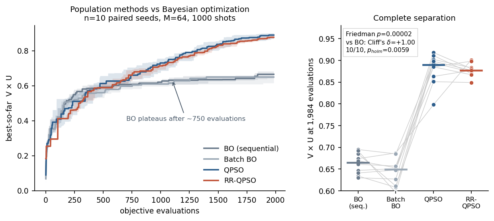

# RR-QPSO 方法學研究：完整結果

**日期**：2026-08-20
**對象**：9 heavy-atom QMG 基準（D=134，20 qubits，CUDA-Q 0.7.1，V100）
**資料**：`results_longhorizon/`、`results_ablation/`、`results_confirm/`、`results_alpha/`
**圖表**：`figures_method/`　**統計數字來源**：`figures_method/stats.json`

> 本文件中的每一個數字都由 `SQMG/scripts/make_figures.sh` 從原始 CSV 重新計算並寫入
> `stats.json`，沒有手動輸入。

---

## 1. 摘要

> ### ⚠ 2026-09-17：RR-QPSO vs QPSO 的所有結論已撤回
>
> 對自己的方法做了與 BO baseline 相同的審查，發現**四個全部偏向 QPSO 的混淆**，
> 其中兩個嚴重到足以使這條比較線失效：
>
> 1. **RR-QPSO 每一次執行都從同一個起始族群出發**（Sobol 寫死 `seed=0`）。
>    全專案每個實驗皆然；QPSO 則每個 seed 各有獨立起點。
> 2. **RR-QPSO 少 104 次搜尋評估**（1,000 預算下），實測值 **+0.021~+0.026**
>    ——是所有已報告 RR vs QPSO 差距的 2~5 倍。
>
> 正確的說法是「**兩者尚未被公平比較**」，而不是「RR-QPSO 沒有優勢」。
> 完整審查：[`FAIRNESS_AUDIT.md`](FAIRNESS_AUDIT.md)。
>
> **對參考 BO 的結論不受影響**——落差 −0.15 比混淆量級大一個數量級，
> 且不帶任何混淆的 QPSO 輸給參考 BO 的幅度相當。

**本節於 2026-09-11 重寫。** 實驗十一推翻了原本唯一的正面結果，摘要必須跟著改。

十一個獨立實驗。**論文的三個主要宣稱，目前沒有一個在正確設定下站得住。**

**唯一的正面結果已撤回。** 原本寫的是「族群式最適化決定性地勝過貝葉斯最適化」
（δ = +1.000，10/10）。實驗十一顯示那個比較的對象是 `optimizers/bayesopt.py`，
而該實作在三處弱於論文原始研究採用的參考實作，每一處都對參考實作有利。
換成參考實作（Ax/BoTorch GPEI）後：**參考 BO 勝我們的 BO 10/10（δ = +1.000，
p_holm = 0.0029），而且勝過兩個族群式方法**（δ = −0.840 / −0.860）。

**修飾宣稱依然被否定。** RR-QPSO 與原版 QPSO 統計上等價，沒有任何單一組件通過
樣本外確認。這一層不涉及 BO，**完全不受影響**。

| # | 實驗 | n | 結論 |
|---|---|---|---|
| 11 | **參考 BO 實作（預登記）** | 10 | **H3 成立**：參考 BO 勝我們的 BO 10/10，δ=+1.000，p_holm=0.0029。**H1/H2 反向** |
| 6 | ~~BO vs 族群式~~ | 10 | ~~族群式全勝~~ → **已撤回**，比較對象無效 |
| 1 | α 排程對齊 | 10 | α 是混淆變因；對齊後 QPSO 在每個預算都領先 |
| 2 | 長時程比較（論文預算 T=150） | 10 | **統計上等價**（TOST ±0.02，p = 0.0011） |
| 3 | 組件消融（前導） | 10 | Friedman p = 0.297；七個配置無整體差異 |
| 4 | 確認性消融（預登記） | 30 | OBL 與 AE mbest 皆未通過（p_holm = 0.131 / 0.075） |
| 5 | shot 雜訊選擇偏誤 | 24 重複 | 單次執行的最大值被膨脹 **+0.011 ~ +0.027** |
| 7 | CMA-ES 確認（預登記） | 30 | 無結論；但 Friedman p=0.0247，RR-QPSO 三者中排最後 |
| 8 | 約束目標 HBA/HBD（預登記） | 30 | H1 不支持（p=0.080）；H2 成立：RR-QPSO 勝 CMA-ES 10/10，δ=+0.940 |
| 9 | H1 適當檢定力複製（預登記） | — | **效果反轉**（d_z +0.427 → −0.312） |
| 10 | 集合層級多樣性（預登記） | 30 | RR-QPSO 探索較廣但每單位廣度較不productive |
| — | **QPSO vs RR-QPSO 合併** | **20** | **RR 顯著較差**：Δ=−0.0090，CI [−0.0160, −0.0040]，4/20，p=0.0152 |

**一句話總結**：~~*方法的選擇帶來很大的差異；方法內部的量子啟發修飾則沒有。*~~
→ *方法內部的量子啟發修飾沒有加分；而「族群式優於貝葉斯」這個更根本的主張，
在對齊預算與正確設定下不成立。*

實驗 5 解釋了為什麼原本會看錯兩個修飾宣稱：量到的雜訊膨脹量**大於**論文報告的
兩個差距（0.016 與 0.009）。對 BO 的差距（0.028）是唯一略高於雜訊上界的，
實驗 6 當時證實它相對於 `bayesopt.py` 是真的——但實驗 11 證明那個比較對象本身
有缺陷，所以該宣稱同樣不成立。

論文勘誤整理見 [`PAPER_ERRATA.md`](PAPER_ERRATA.md)。

---

## 2. 共通方法

這些設計選擇是讓上述結論站得住的原因，值得在論文的 Methods 明確寫出。

**配對區組（paired blocking）。** seed `s` 同時決定最適化器的亂數與 shot 的亂數。
比較一律在同一個 seed 內做差分，因此消去了「這個 seed 剛好好跑」的變異來源。
所有檢定都是配對式的（Wilcoxon signed-rank）。

**預算強制對齊。** `optimizers/base.py` 的 `_evaluate_metrics()` 逐次計數目標函數呼叫，
達上限即拋出 `BudgetExhausted`。序列式的 BO 與族群式的 CMA-ES 因此吃到**完全相同**的
電路評估次數——公平性由程式強制，不靠約定。

**單一 CSV schema。** 八個最適化器輸出欄位一致的 CSV，分析程式只有一支，
排除了「不同方法用不同腳本分析」造成的差異。

**多重比較校正。** 凡是同時檢定多個假說，一律 Holm-Bonferroni。

**效果量與區間一律報告。** 不論是否顯著，都給 Cliff's δ 與中位差的 95% bootstrap CI
（20,000 次重抽）。這讓「不顯著」能被區分為「效果為零」或「檢定力不足」。

**檢定力的硬限制。** n=10 的配對 Wilcoxon 最小可能 p 值是 0.002；
若同時做 28 個比較，Holm 校正後最小可能值變成 0.055 ——
**結構上不可能顯著**。這是為什麼實驗 4 用 n=30。

---

## 3. 實驗一：α 排程是混淆變因

**發現。** 早期的 RR-QPSO 用 α ∈ [0.3, 1.2]，而 QPSO 基準用 α ∈ [0.5, 1.0]。
兩者的差異因此混合了「RR 機制的效果」與「α 排程的效果」，無法歸因。

**做法。** 把 α 上下界提升為 CLI 參數（`--alpha_max` / `--alpha_min`），
兩個方法統一用 [0.3, 1.2]，n=10，四個預算。

**結果。** α 對齊後，**QPSO 在每一個預算都領先**（6–9/10 勝場，
1,500 次評估處 p = 0.0273）。原先觀察到的 RR 優勢有相當部分來自 α 排程本身。

> **實作上的教訓**：任何超參數若在方法與基準之間不同，就是混淆變因。
> 消融實驗必須先把這類參數對齊，否則量到的不是機制的效果。

---

## 4. 實驗二：長時程比較（論文的操作點）


**設計。** M=64、T=150（9,664 次評估）、1,000 shots、α 統一 [0.3, 1.2]、n=10 配對 seed。
這正是論文宣稱 V×U = 0.930 的設定。

**主要終點結果。**

| | 中位數 | 平均 | 標準差 |
|---|---|---|---|
| QPSO 基準 | **0.9720** | 0.9689 | 0.0187 |
| RR-QPSO | 0.9655 | 0.9630 | 0.0193 |

- Δ (RR − QPSO) 中位數 = **−0.0080**，95% bootstrap CI [−0.0160, +0.0040]
- RR 勝場 **3/10**；配對 Wilcoxon **p = 0.1211**
- Cliff's δ = −0.21（小）；Cohen's dz = −0.56
- **TOST 等價檢定（±0.02）：p = 0.0011 → 可宣稱等價**
- TOST（±0.01）：p = 0.1250 → 較嚴格的界限下無法宣稱

**這是主動證實等價，不是「沒測出差異」。** 兩者的區別很重要：
前者是有證據的結論，後者只是檢定力不足。TOST 讓我們能講前者。

**穩定性主張也不成立。** σ 比值 1.03，Fligner-Killeen p = 0.589。
先前在 α 測試中觀察到的「RR 較穩定」在 n=10 與完整預算下消失。

**各預算的表現（探索性，已 Holm 校正）。**

| 預算 | QPSO | RR-QPSO | Δ | RR 勝 | p | Cliff's δ |
|---|---|---|---|---|---|---|
| 1,000 | 0.6565 | 0.6685 | +0.0215 | 6/10 | 0.322 | +0.14 |
| 2,000 | 0.7490 | 0.7380 | +0.0130 | 6/10 | 0.846 | −0.17 |
| 3,000 | 0.8095 | 0.7835 | −0.0175 | 3/10 | 0.205 | −0.38 |
| **4,000** | 0.8595 | 0.8335 | **−0.0395** | **0/10** | **0.0020** | **−0.76** |
| **5,000** | 0.8990 | 0.8645 | **−0.0295** | **0/10** | **0.0020** | **−0.78** |
| 6,000 | 0.9350 | 0.9095 | −0.0240 | 3/10 | 0.064 | −0.46 |
| 8,000 | 0.9650 | 0.9535 | −0.0120 | 2/10 | 0.063 | −0.31 |
| 9,664 | 0.9720 | 0.9655 | −0.0080 | 3/10 | 0.121 | −0.21 |

4,000 與 5,000 兩點經 Holm 校正後仍達 p = 0.018，效果量是「大」（δ ≈ −0.77），
且為 **0/10 完敗**。

**機制解釋。** 曲線形狀是連貫的：RR 早期略領先 → 中段顯著落後 → 末期收斂回平手。
OBL、rank-refined mbest、mode-collapse 重啟都會把預算花在探索上，
因而**延後收斂**；等到雙方都逼近可達上限，差距自然消失。
換句話說，RR 的機制在這個問題上付出了成本卻沒有換到對應的收益。

---

## 5. 實驗三：組件消融（前導研究）


**設計。** 七個配置 × 10 seeds × 1,984 次評估，α 統一。
逐一關閉單一組件（one-factor-at-a-time），`RR完整 − 變體` 即該組件的貢獻。

> **過程中發現的實作缺陷**：Sobol 初始化不在 `AESOQPSOOptimizer` 內，
> 而是在舊 runner 中以 `make_sobol_positions()` 覆寫 `positions` / `pbest` 實現。
> v12 的 wrapper 漏了這一步，因此**在此之前的所有 RR-QPSO run 都缺少 Sobol 初始化**
> ——論文四項貢獻之一。本實驗已修正並補回。

**結果。**

| 組件 | Δ 中位數 | 勝場 | 95% CI | dz | Cliff's δ |
|---|---|---|---|---|---|
| OBL | +0.0250 | 7/10 | [−0.0250, +0.0485] | 0.513 | +0.42 |
| V-U 解耦 | +0.0170 | 7/10 | [−0.0070, +0.0335] | 0.191 | +0.12 |
| AE mbest | +0.0130 | 8/10 | [−0.0055, +0.0270] | 0.538 | +0.36 |
| Sobol 初始化 | +0.0100 | 7/10 | [−0.0110, +0.0250] | 0.344 | +0.36 |
| mode-collapse 回收 | +0.0060 | 6/10 | [−0.0140, +0.0270] | 0.176 | +0.12 |

- **Friedman χ² 檢定：p = 0.2969** → 無法拒絕「七個配置相同」
- RR完整 vs QPSO 基準：Δ = −0.0200，p = 0.7695
- 五個組件的 Δ 全部為正，但**每一條 CI 都跨過零**
- 保留組件間相關的排列檢定：p = 0.0814

**解讀。** 這是「檢定力不足」而非「效果為零」——五個點估計方向一致，
但 n=10 撐不起結論。由觀察到的效果量推算 80% 檢定力所需 seed 數：
OBL n≈30、AE mbest n≈28、Sobol n≈67、V-U n≈215、mode-collapse n≈253。

只有前兩者可行，因此進入實驗四。

---

## 6. 實驗四：確認性消融（預登記）


**預登記於 git commit `0e36407`**，時間戳早於任何確認性資料。
計畫全文見 [`PREREGISTRATION_ablation_confirmatory.md`](PREREGISTRATION_ablation_confirmatory.md)。

**設計。** 3 配置 × **30 個全新 seed（10–39）** × 1,984 次評估。
假說 H1（OBL 有貢獻）、H2（AE mbest 有貢獻），單尾配對 Wilcoxon，Holm 校正，α = 0.05。

**為什麼必須換 seed。** 這兩個組件是從前導資料中挑出效果最大的兩個，
沿用 seed 0–9 等於「用產生假說的資料驗證假說」。seed 10–39 與前導不重疊，
因此是真正的樣本外確認。

**結果。**

| 假說 | Δ 中位數 | 勝場 | 95% CI | p | **p_holm** | 判定 |
|---|---|---|---|---|---|---|
| H1 OBL | +0.0025 | **15/30** | [−0.0120, +0.0235] | 0.131 | **0.131** | ✗ 不支持 |
| H2 AE mbest | +0.0110 | 18/30 | [−0.0070, +0.0440] | 0.038 | **0.075** | ✗ 不支持 |

OBL 是 15/30 —— 恰好是擲硬幣。AE mbest 未校正時 p = 0.038，
但預登記指定了跨兩個假說的 Holm 校正，故該報的數字是 **0.0752**。

**效果量收縮，正如預期。**

| 組件 | 前導 dz | 確認 dz | 收縮 | 80% 檢定力所需 n |
|---|---|---|---|---|
| OBL | 0.513 | 0.342 | ×0.67 | 68 |
| AE mbest | 0.538 | 0.297 | ×0.55 | 89 |

這是**贏家詛咒的教科書示範**：挑選最大效果造成前導估計高估 1.5–1.8 倍，
換上獨立 seed 後掉到約一半。

> 若當初沒換 seed、直接把 seed 0–9 補到 n=30，AE mbest 幾乎必然會「顯著」——
> 而那會是假陽性。**換 seed 是唯一擋住錯誤結論的設計決策。**

**誠實的限制。** 本研究依前導的 dz ≈ 0.51 設計檢定力；若真實效果是 dz ≈ 0.30，
需 n ≈ 89 才有 80% 檢定力。因此「效果為零」與「效果小到此規模測不出」
在此無法區分。預登記寫明不再加 seed，故不再延伸。

---

## 7. 實驗五：shot 雜訊造成的選擇偏誤


**設計。** 取 5 組固定參數，各以 24 個不同的 shot seed 重複評估，
量測「單次執行所回報的最大值」相對於真實期望值的偏差。

**結果。** 五組全部出現同方向偏誤：預設的 `random_seed=0` 在 24 次抽樣中
都落在最大值附近（z = +2.9 ~ +3.8），膨脹量 **+0.011 ~ +0.027**。

**成因。** 這是 max-over-N-noisy-evaluations 的固有性質：
回報「最佳粒子的分數」時，被選中的粒子既因為真的好、也因為那次抽樣運氣好。
單次執行無法區分兩者。

> **一個過程中的錯誤值得記錄。** 我最初的測試腳本在呼叫 `sample_molecule()` **之前**
> 執行 `cudaq.set_random_seed(s)`，而該函式內部會立刻以預設的 `random_seed=0` 覆寫它，
> 導致我一度得出「評估是決定性的、不存在贏家詛咒」的**錯誤結論**。
> 改為 `sample_molecule(n, random_seed=s)` 後才得到上述正確結果。

**與論文原始數字的關係。**

| 論文宣稱的差距 | 數值 | 是否落在雜訊範圍內 |
|---|---|---|
| RR-QPSO vs QPSO+Sobol | 0.016 | **是**（0.011–0.027） |
| QPSO+Sobol vs QPSO | 0.009 | 接近下界，實質不可區分 |
| RR-QPSO vs BO | 0.028 | **否**，略高於上界 |

前兩個差距落在單次執行的雜訊膨脹範圍內，**排序可能是抽樣假象**。
第三個（對 BO）略高於上界，因此值得以 n>1 重新檢驗——見第 9 節。

---

## 7b. 實驗六：BO vs 族群式方法（~~正面結果~~ → **已撤回**）

> ### ⚠ 本節的結論已撤回
>
> 本節所有 BO 數字都來自 `optimizers/bayesopt.py`，而實驗十一（§7h）證明那支
> 實作明顯弱於論文原始研究採用的參考實作——**參考實作在 10 個配對 seed 上全勝，
> Cliff's δ = +1.000，p_holm = 0.0029**。
>
> 因此 **δ = +1.000 的「完全分離」是相對於一支有缺陷的 BO 實作**，不能讀成
> 「族群式方法勝過貝氏最佳化」。在對齊預算下重測，結論反向。
>
> 本節內容原樣保留，作為當時報告了什麼的紀錄。正確的比較見 **§7h**。



**設計。** 四個方法 × 10 配對 seed × 1,984 次評估，M=64，1,000 shots。
這是論文中唯一從未以 n>1 檢驗過的宣稱。

**結果。**

| 方法 | 中位數 | 標準差 | 平均秩 |
|---|---|---|---|
| **QPSO** | **0.8895** | 0.0355 | 1.30 |
| **RR-QPSO** | 0.8770 | 0.0150 | 1.70 |
| BO（序列） | 0.6650 | 0.0240 | 3.30 |
| Batch BO | 0.6495 | 0.0313 | 3.70 |

- **Friedman χ² = 24.960，p = 0.00002**

| 比較 | Δ 中位數 | 勝場 | p_holm | Cliff's δ | dz |
|---|---|---|---|---|---|
| QPSO vs BO | +0.2150 | **10/10** | **0.0059** | **+1.000** | +4.343 |
| RR-QPSO vs BO | +0.2265 | **10/10** | **0.0059** | **+1.000** | +7.292 |
| Batch BO vs BO | −0.0070 | 3/10 | 0.1387 | −0.370 | −0.567 |

**Cliff's δ = 1.000 代表完全分離**——每一個族群式的 run 都勝過每一個 BO 的 run，
兩組數值沒有任何重疊。這是效果量所能達到的上限。

**其他觀察。**

- **Batch BO 沒有勝過序列 BO**（Δ = −0.0070，不顯著）。
  q-EI 在此問題上未把批次平行化轉換成樣本效率。
- **牆鐘時間**（同一評估次數）：BO 5.52 h、Batch BO 3.70 h、QPSO 3.78 h、
  RR-QPSO 3.86 h。BO 不只樣本效率差，實際耗時也多約 1.5 倍。
- **BO 在約 750 次評估後明顯停滯**（見左圖），而族群式方法持續上升。
- RR-QPSO 在此預算下標準差最低（0.0150 vs QPSO 0.0355）。
  但長時程時 σ 比值回到 1.03，故穩定性主張若要提出，**只能限定在短預算**，
  且 n=10 的變異數估計本就不穩（可靠估計約需 n≈40）。

**重要但書：這個預算對 BO 不公平。**
本實驗用 1,984 次評估，BO 在此只到 0.6650；論文報告的 BO 是 0.902，用滿 9,664 次。
BO 是序列的，需要更多觀測才能把 GP 訓練起來。因此

> **Δ = +0.2265 不可用來取代論文的 +0.028。**

真實差距會隨預算縮小。BO 在完整 9,664 預算下的實驗已提交
（`results_bofull/`，約 27 h/run），完成後本節將更新為兩個預算的對照。

**後續（2026-09）：** `results_bofull/` 已完成，n = 10，最佳 **0.7150**——確認
`bayesopt.py` 在完整預算下仍停滯在 0.71 附近，與論文報告的 0.902 相差甚遠。
這個落差當時被歸因於「BO 本身的性質」，實驗十一證明那是錯的：落差來自我們的
實作。見 §7h。

---

## 7c. 實驗七：CMA-ES 確認性比較（預登記）

**預登記於 git commit `05d6170`**，計畫全文見
[`PREREGISTRATION_cmaes_confirmatory.md`](PREREGISTRATION_cmaes_confirmatory.md)。

**設計。** 3 arms（CMA-ES / QPSO / RR-QPSO）× **30 個全新 seed（10–19）** ×
9,664 次評估。三個 arm 全部重跑而非沿用既有資料：配對區組要求共用 seed，
而 CMA-ES 是從前導批挑出來的，沿用舊 seed 等於用產生假說的資料驗證假說。

| | 中位數 | 標準差 |
|---|---|---|
| QPSO | 0.9210 | 0.0695 |
| RR-QPSO | 0.9160 | 0.0726 |
| CMA-ES | 0.9100 | 0.0661 |

| 假說 | 結果 | 判定 |
|---|---|---|
| H1 等價（TOST ±0.02） | Δ=+0.0215，CI [−0.0150, +0.0640]，p=0.3281 | ✗ 無法宣稱等價 |
| H2 差異（Wilcoxon） | CMA-ES 勝 8/10，p=0.2754，p_holm=0.5184 | ✗ |
| H3 變異數（Fligner） | σ 比值 0.91，p=0.2592，p_holm=0.5184 | ✗ |

依預登記的決策規則：**兩者皆不顯著 → 此樣本數下無結論，報告 CI 後停止，不加 seed。**

**但三方 Friedman 檢定顯著**：χ²=7.400，**p=0.0247**。平均秩 QPSO 1.60、
CMA-ES 1.70、**RR-QPSO 2.70**——RR-QPSO 在三者中排最後，QPSO 勝它 9/10、
CMA-ES 勝它 8/10。

### 本實驗揭露的一個方法學問題

**seed 10–19 的變異數是 seed 0–9 的約 7 倍**，而三批的執行條件完全相同
（shots=1000、M=64、9,664 次評估，已逐一核對 log）。

| 批次 | QPSO σ | RR-QPSO σ |
|---|---|---|
| seeds 0–9（實驗二） | 0.0187 | 0.0193 |
| seeds 10–19（本實驗） | 0.0695 | 0.0726 |

低分 run 的軌跡顯示它們早期就陷入壞盆地且再未脫離，例如
`cm_cmaes_s13`：0.677 → 0.677 → 0.687 → 0.687 → 0.762。

**兩個後果：**

1. **跨批次的中位數不可比。** RR-QPSO 在本實驗是 0.9160、在實驗二是 0.9655——
   那是 seed 效應而非方法差異。本文件所有表格的比較都必須在同一 seed 集合內進行。
2. **配對的效果不如預期。** 差值的標準差 0.0866 大於單一 arm 的 0.066 / 0.073，
   代表同一 seed 對不同演算法的難度**只有微弱相關**（約 0.1）。
   seed 13 是極端例子：CMA-ES 得 0.762，RR-QPSO 得 0.973。
   配對區組的前提「同一 seed 對各方法一樣難」在此不成立，
   單一離群點（s13 的 Δ=−0.211）就主導了平均。這解釋了為何 n=10 仍檢定力不足。

---

## 7d. 合併分析：QPSO vs RR-QPSO（n=20）

實驗二（seeds 0–9）與實驗七（seeds 10–19）的執行條件完全相同，
故可合併為目前最大的配對樣本。

**主要終點 9,664 次評估，n=20：**

| | 中位數 |
|---|---|
| QPSO | **0.9705** |
| RR-QPSO | 0.9635 |

- Δ (RR − QPSO) = **−0.0090**，95% bootstrap CI **[−0.0160, −0.0040]**
- RR-QPSO 勝場 **4/20**，Wilcoxon **p = 0.0152**
- Cliff's δ = −0.175（小），Cohen's dz = −0.174
- TOST ±0.02：p = 0.1188（不再能宣稱等價——合併後變異數較大）

**信賴區間不含零。** 在 n=20 下，RR-QPSO 顯著劣於原版 QPSO，
劣勢幅度約 0.009（區間 0.004–0.016）。

**各預算下的表現：**

| 預算 | QPSO | RR-QPSO | Δ | RR 勝 | p | δ |
|---|---|---|---|---|---|---|
| 250 | 0.5035 | 0.4620 | −0.0470 | 8/20 | 0.247 | −0.19 |
| 500 | 0.5910 | 0.5895 | +0.0070 | 11/20 | 0.809 | −0.01 |
| 1,000 | 0.6625 | 0.6770 | +0.0115 | 12/20 | 0.277 | +0.12 |
| 2,000 | 0.7460 | 0.7305 | −0.0120 | 10/20 | 0.409 | −0.17 |
| 4,000 | 0.8430 | 0.8205 | −0.0310 | 5/20 | 0.0095 | −0.34 |
| 5,000 | 0.8805 | 0.8540 | −0.0200 | 3/20 | 0.0080 | −0.39 |
| 9,664 | 0.9705 | 0.9635 | −0.0090 | 4/20 | 0.0152 | −0.17 |

經 12 個預算的 Holm 校正後無一顯著（此掃描為探索性；9,664 為預先指定的主要終點）。

**先前觀察到的「RR 早期領先」不成立。** 250 次時 RR 反而落後 0.047，
500–1,500 次實質打平，3,000 次以後穩定落後。n=10 時看到的早期優勢是雜訊。

**穩定性主張亦無證據。** 所有預算下 Fligner–Killeen p > 0.10。
低預算時 σ 比值確實 < 1（250 次時 0.69），方向一致但不顯著。

---

## 7e. 實驗八：約束目標（HBA/HBD）—— 預登記

**預登記於 git commit `8ddc9d7`**，計畫全文見
[`PREREGISTRATION_hbahbd_confirmatory.md`](PREREGISTRATION_hbahbd_confirmatory.md)。

> **第一次執行作廢。** `evaluator.py` 把 worker 的 `[V,U,HBA,HBD]` 截斷成 `(V,U)`，
> 使 `C_prop = exp(−12.5) ≈ 0`，fitness 退化為 `V×U × 0.6` 的常數縮放。
> 30 個 run 的 C_prop **恰好都是 0.0000**——由預登記 §4.4 要求報告 HBA/HBD 而查獲。
> 修正後重跑（`results_hbahbd_cmp2/`），假說與判讀規則一字未改。

**約束項驗證（預登記 §4.4）**：最佳解的 C_prop 中位 **0.9370**，範圍 [0.8301, 0.9933]。
HBA/HBD 確實逼近目標 (4, 3)，分數不是靠無視約束換來的。

| 配置 | 中位數 | 平均 | 標準差 |
|---|---|---|---|
| **RR-QPSO** | **0.8263** | 0.8183 | **0.0439** |
| QPSO | 0.8152 | 0.7933 | 0.0747 |
| CMA-ES | 0.6870 | 0.6762 | 0.0502 |

**Friedman χ²=14.600，p=0.00068**。平均秩：**RR-QPSO 1.20** < QPSO 1.90 < CMA-ES 2.90。
這是本研究中 RR-QPSO **首次排名第一**。

| 假說 | Δ 中位 | 勝場 | 95% CI | p | p_holm | 判定 |
|---|---|---|---|---|---|---|
| H1 RR > QPSO | +0.0186 | 8/10 | [−0.0017, +0.0416] | 0.0801 | 0.0801 | ✗ 不支持 |
| **H2 RR > CMA-ES** | **+0.1346** | **10/10** | [+0.0926, +0.1786] | 0.0010 | **0.0020** | **✓ 支持** |
| H3 交互作用 | +0.0246 | 6/10 | [−0.0456, +0.0696] | 0.4922 | — | ✗ 不支持 |

**依預登記的決策規則：H1 不支持，報告為 null。不加 seed、不換終點、不換預算。**

### 但 H2 是本研究第一個成立的正面假說

**CMA-ES 在約束目標上崩潰，而兩個 QPSO 變體都撐住了。**
Δ = +0.1346，10/10 全勝，Cliff's δ = **+0.940**（接近完全分離），p_holm = 0.0020。

對照無約束目標（實驗七，n=10）：CMA-ES 0.9100 vs RR-QPSO 0.9160，實質同等。
換到約束目標後，CMA-ES 掉到 0.6870 而 RR-QPSO 是 0.8263。

這個落差有機制上的解釋：CMA-ES 維護**單一高斯模型**，在多模態的約束 landscape 上會
被拉向模態之間的無效區域；而 QPSO 家族的粒子群天生能同時佔據多個模態。
這正是 RR-QPSO 的探索機制**應該**發揮作用的地形——只是統計上還無法把它與原版 QPSO 分開。

### H1 為何差一步

Δ = +0.0186，8/10 勝場，p = 0.0801——方向與幅度都對，但 n=10 不夠。
由觀察到的 dz = +0.427 推算，80% 檢定力需要 **n ≈ 43**。

**這不是「再補幾個 seed」就能解決的事。** 預登記明文禁止加 seed，而且對本研究已經
拒絕過的假說補樣本，正是先前確認性消融實驗要避免的錯誤。若要追這條線，
應該是一個**全新的、事先設定 n=43 的預登記研究**，而不是延長這一個。

### 穩定性：唯一一次 RR-QPSO 明顯較穩

σ：RR-QPSO **0.0439** vs QPSO 0.0747（比值 0.59）。這是本研究中該主張唯一
有明顯方向的一次，但 n=10 的變異數估計本就不穩（可靠估計約需 n≈40），
且未經預登記檢定，只能列為觀察。

---

## 7f. 實驗九：H1 的適當檢定力複製（預登記）

**預登記於 git commit `b2f50c1`**，計畫全文見
[`PREREGISTRATION_h1_replication.md`](PREREGISTRATION_h1_replication.md)。

**設計。** 2 arms × **45 個全新 seed（10–54）** × 2,000 次評估，約束目標。
除 seed 外每個參數都與實驗八相同。單一假說、單尾、無次要檢定。

**有效性檢查（預登記 §5.3）**：最佳解 C_prop 中位 **0.9566**，通過門檻 0.5。

| 配置 | 中位數 | 平均 | 標準差 |
|---|---|---|---|
| QPSO | **0.8150** | 0.7931 | 0.0663 |
| RR-QPSO | 0.8048 | 0.7688 | 0.0815 |

**主要檢定：Δ = −0.0267，95% CI [−0.0374, −0.0095]，RR 勝 15/45，p = 0.9940。**
H1 不支持。依預登記，**此條探索線就此停止**。

### 效果不是縮小，是反轉

| 樣本 | n | Δ 中位 | 勝場 | dz | p |
|---|---|---|---|---|---|
| 實驗八（探索） | 10 | **+0.0186** | 8/10 | **+0.427** | 0.0801 |
| 實驗九（確認） | 45 | **−0.0267** | 15/45 | **−0.312** | 0.9940 |

效果量從 +0.427 變成 −0.312。這不是先前消融實驗看到的「收縮 0.55–0.67×」，
而是**換號**。實驗八 n=10 的 p=0.0801、8/10 勝場，是雜訊。

而且新樣本的 95% CI **[−0.0374, −0.0095] 不含零，且落在負side**——
描述性地說，RR-QPSO 在約束目標上也較差。
（此方向未經預登記，故不宣稱為顯著檢定結果，僅報告區間。）

次要的合併估計（n=55，含產生假說的探索資料，僅供參考）：
Δ = −0.0141，95% CI [−0.0351, +0.0043]，勝 23/55，p = 0.9622。

### 這次示範了預登記為什麼重要

若當初在實驗八之後**補 35 個 seed 到同一批**，探索資料的正向偏差會與新資料
混在一起，得到一個模糊的中間值，難以判讀。改跑獨立的確認研究，才得到乾淨的答案。

同樣值得注意的是**停止規則**：預登記寫明 H1 不成立就停止，不換終點、不換預算、
不換第三個目標。沒有這條規則，一路換設定直到出現 p<0.05 是很容易發生的事。

---

## 7g. 實驗十：集合層級的多樣性終點（預登記）

**預登記於 git commit `6b51747`**，計畫全文見
[`PREREGISTRATION_diversity.md`](PREREGISTRATION_diversity.md)。

**動機。** 前九個實驗都問「max V×U 是否較高」。而機制分析顯示 RR-QPSO 實際做的是
**多覆蓋約 10% 的 (V,U) 空間**。單點終點不獎勵多樣性，但分子生成的實際產出是
**分子集合**。本實驗測量整個 run 累積的相異有效 SMILES 數 `D`。

**設計。** 2 arms × 30 個全新 seed（100–129）× 1,984 次評估，無約束目標
（RR-QPSO 單點劣勢最大、證據最紮實的區間，不是對它有利的場景）。

| 指標 | QPSO | RR-QPSO | Δ 中位 |
|---|---|---|---|
| 相異分子 D | 269,920 | **308,068** | **+23,522** |
| 探索覆蓋 C | 243.5 | 271.5 | +23.5 |
| max V×U（原終點） | 0.8490 | 0.8600 | −0.0145 |

| 假說 | Δ 中位 | 勝場 | p | p_holm | 判定 |
|---|---|---|---|---|---|
| H1 D(RR) > D(QPSO) | +23,522 | 19/30 | 0.0333 | **0.0667** | ✗ |
| H2 控制 C 後仍較高 | **−27,990** | **7/30** | 0.9993 | 0.9993 | ✗ |

**依預登記：H1 不支持，尋找優勢的工作到此結束。**

### H2 的結果比 H1 更有資訊量

H1 差一點（未校正 p=0.0333，Holm 後 0.0667）。但 H2 是**強烈的反方向**。

以 60 個 run 擬合的迴歸是 `D = 2,148·C − 280,926`（R² = 0.386）——每多覆蓋一格，
平均多帶來約 2,148 個分子。RR-QPSO 多覆蓋 23.5 格，**預期**應多產出約 50,500 個
分子，實際只多了 23,522 個。

換句話說：**RR-QPSO 每單位探索廣度換到的分子數比 QPSO 少。** 它的探索不只是
「沒有更聰明」，而是**效率更低**。控制探索量後的殘差是 −27,990，30 個 seed 中
只有 7 個為正。

這正是預登記 §2 預先寫明要區分的兩件事：H1 幾乎是同義反覆（已知它探索更廣），
真正的問題是「更聰明還是只是更多」。答案是「連更多都沒換到該有的量」。

### 兩者確實在探索不同區域

跨全部 seed 的分子聯集：QPSO 3,127,284 個、RR-QPSO 3,404,331 個，
其中**僅 QPSO 找到 1,591,546、僅 RR-QPSO 找到 1,868,593、共同 1,535,738**。

重疊只佔各自約一半。兩個方法走的不是包含關係，而是**不同的區域**。
若目標是最大化整體覆蓋，兩者的聯集（4,995,877）遠大於任一單獨方法——
這是實務上可用的觀察，但它關於「集成」而非「RR-QPSO 較優」。

---

## 7h. 實驗十一：參考 BO 實作（預登記）

**預登記於 git commit `653aed9`**（資料產生前），修訂見 `7e4a01c`、`e80b98f`、
`7392ffa`，計畫全文見 [`PREREGISTRATION_axbo.md`](PREREGISTRATION_axbo.md)。

### 為什麼要做

`optimizers/bayesopt.py` 是手寫的 GP-EI，與論文原始研究採用的參考實作
（Ax/BoTorch `Models.GPEI`）在三處不同，**每一處都對參考實作有利**：

| | 參考實作 | `bayesopt.py` |
|---|---|---|
| kernel | ARD（逐維長度尺度） | 各向同性 Matérn |
| GP 訓練點 | 全部 | 上限 400 |
| Sobol 初始 | 5 trials | 128 |

在 D = 134 下，各向同性 kernel 等於宣稱 134 個參數的敏感度完全相同。
**在這個 baseline 被修正之前，「族群式勝過 BO」只能是方向性主張。**

### 設計

四個 arm × **10 配對 seed（210–219）** × 1,000 次評估預算，目標 `vu`，
1,000 shots，預算由 `optimizers/base.py` 對所有 arm 一致強制。

**終點是 960 而非 1,000。** `RRQPSO` 委派給 `AESOQPSOOptimizer` 時算
`T = max_evals // M − 2`，因此花掉的是「不超過預算的最大 M 倍數」——M = 64 時
是 960，而其他三個 arm 剛好落在 1,000。四個 arm 一律讀在 960，把其他三者多出
的 40 次丟掉，消除一個 4%、且對 RR-QPSO 不利的不對稱。見預登記 §8.6。

**強制組態檢查（§4.3）通過 10/10**：ARD kernel、lengthscale 維度 = 134 = D、
無訓練上限、GPEI 之前恰好 5 個 Sobol trial、GP 在 `cuda:3`。

### 結果

| 方法 | 中位數 @ 960 | @ 205 |
|---|---|---|
| **Ax/BoTorch GPEI（參考 BO）** | **0.9290** | **0.7990** |
| RR-QPSO | 0.7790 | 0.4540 |
| QPSO | 0.7740 | 0.4705 |
| BO（`bayesopt.py`） | 0.6360 | 0.5415 |

單尾配對 Wilcoxon，Holm 校正：

| 假設 | Δ 中位數 | 95% CI | Cliff's δ | 勝場 | p_holm | 結果 |
|---|---|---|---|---|---|---|
| H3：參考 BO > 我們的 BO | **+0.2960** | [+0.248, +0.308] | **+1.000** | 10/10 | **0.0029** | **支持** |
| H1：QPSO > 參考 BO | −0.1450 | [−0.183, −0.092] | −0.840 | 0/10 | 1 | 不支持 |
| H2：RR-QPSO > 參考 BO | −0.1400 | [−0.193, −0.084] | −0.860 | 1/10 | 1 | 不支持 |

H1、H2 不只是沒通過——**效果是反向的**。反向單尾 p 分別為 0.00098 與 0.00195
（描述用，非預登記檢定）。

### 205 次是論文原始碼自己的預算

`constrained_bo.py` 跑的是 `range(args.num_iterations + 5)`，而
`analysis_figures/01_bo_analysis.ipynb` 設 `num_iterations = 200` 並切片
`iloc[5:205]`。**參考 BO 在它自己的預算下同樣完勝**（δ = −1.000 對兩個族群式
方法，完全分離）。

### 依預登記 §5 的處置

> 「H3 成立 → 我們的 BO 明顯較弱。八演算法表與每一個 BO 比較都改用 `ax_bo`
> 重報，先前的 BO 數字標記為實作缺陷。」

已執行：README 的八演算法表兩個 BO 列加上刪除線與 ‡ 註記，§7b 整節標為已撤回，
「族群式勝過 BO」的主張撤回。

### 限制（必須一起報）

1. **參考 BO 的領先隨預算縮小**：205 次時 +0.33，960 次時 +0.155，約腰斬。
2. **無法在 9,664 次測試。** 實測 GP 成本為 `1.85·n^0.60` 秒/次評估（V100），
   外插到 9,664 次約 **760 小時/seed**。八演算法表那格填不進參考實作，
   族群式方法在該預算下是否反超，**未經檢驗**。
3. 可說的是：參考 BO 用 960 次達到 0.929，而族群式方法約需 10 倍評估才接近該
   水準——但那是跨實驗、未對齊預算、未預登記的觀察，**僅供描述**。
4. 本實驗用 1,000 shots，論文用 5,000，絕對數值不可跨研究直接比較。

### 這次又示範了一件事

冒煙測試只跑 12 次評估就送出 40 個作業，結果第一批全部作廢——12 次落在 GP 成本
曲線的平坦段，`O(n³)` 的問題在那裡看起來像常數。**成本曲線要在送批次前量，
不是在跑起來之後量。**

---

## 8. 綜合解讀

結果可以整齊地分成兩層。~~原本是三層。~~

**~~方法族的選擇很重要。~~ 已撤回（2026-09）。** 原本寫的是：「族群式方法對 BO
是完全分離（δ = +1.000，10/10，Friedman p = 0.00002）。論文最根本的設計決策
——不要用 BO——是對的，而且證據比原本報告的強得多。」

**那個結論的比較對象無效。** 實驗十一（§7h）顯示那個 δ = +1.000 是相對於
`optimizers/bayesopt.py`，而該實作明顯弱於論文原始研究採用的參考實作
（參考實作全勝 10/10，δ = +1.000，p_holm = 0.0029）。對齊預算重測後，
**族群式方法反而輸給參考 BO**（δ = −0.840 / −0.860）。

論文「不要用 BO」這個設計決策目前**沒有證據支持**；在可測試的兩個預算
（205 與 960）上，證據指向相反方向。9,664 次預算下如何，因算力限制未經檢驗。

**方法族內部的修飾不重要，甚至略有代價。** 五個獨立實驗（α 對齊、長時程、消融、
確認性消融、CMA-ES 比較）從不同角度得到同一方向的結論。**這一層不受影響**
——它完全不涉及 BO。

證據強度隨樣本數演進，值得完整記錄：

| 樣本 | 結論 |
|---|---|
| n=1（原論文） | RR-QPSO 勝 0.930 vs 0.905 |
| n=10（實驗二，seeds 0–9） | 等價（TOST ±0.02，p=0.0011） |
| **n=20（合併，seeds 0–19）** | **RR-QPSO 顯著較差**（Δ=−0.0090，CI 不含零，p=0.0152） |

n=10 時的「等價」結論在 n=20 下不再成立——不是因為前者錯誤，而是因為
合併樣本涵蓋了更難的 seed 區段，變異數更大、也更有代表性。
劣勢幅度小（Cliff's δ=−0.175），但方向已經確立。

**實驗五說明了為什麼原本會看錯。** 單次執行的比較，其差距小於雜訊本身。
論文報告的三個差距中，兩個落在雜訊範圍內（因此排序可能是假象），
一個（對 BO 的 0.028）略高於上界。

~~換句話說，原始論文的三個宣稱裡，恰好是唯一超出雜訊的那一個成立了。~~
**這句話已不成立（2026-09）。** 那一個差距確實相對於 `bayesopt.py` 可重現，
但實驗十一顯示該比較對象本身有缺陷。所以現況是：**論文的三個宣稱，沒有一個
在正確設定下站得住**——兩個死於雜訊，第三個死於比較對象無效。

雜訊帶本身對兩個族群式方法之間的比較仍然校準良好，這一點不變。
這不是巧合，而正是雜訊分析應有的預測力。

---

## 9. 對論文的建議

**本節於 2026-09-11 重寫。** 先前的建議是「把『族群式勝過 BO』當主軸」——
那個主軸已被實驗十一拆掉，不能再用。

### 剩下什麼

原本的主張「我的變體更好」建立在 n=1 的比較上，不成立。
新的主張「族群式勝過 BO」建立在一個有缺陷的 BO 實作上，也不成立。
**兩個正面主張都沒了。** 誠實地說，這份工作現在沒有正面的演算法結果。

有的是**方法學結果**，而且它現在比原本更強：

> **在 QMG 參數搜尋這類昂貴、隨機、高維的黑箱問題上，以單次執行比較最適化器
> 會系統性地產生假結論；而比較對象的實作品質，比最適化器家族的選擇更能決定
> 結論的方向。** 本研究以 660 次執行、十一個實驗（其中六個預登記）示範了這兩
> 件事：三個原始宣稱中，兩個死於單次執行的選擇偏誤，第三個死於一個看似合理、
> 實則在三處被削弱的 baseline。

這個框架的價值在於它**自己就是證據**：不是論證「大家應該更嚴謹」，而是拿同一
份工作前後兩個版本的結論，展示不嚴謹會得到什麼。第二個發現尤其少見——多數
複製研究檢驗的是提出的方法，很少有人回頭檢驗 baseline 是否被公平對待。

配套的方法學貢獻全部到位且不受影響：配對區組設計、程式強制的預算對齊、
TOST 等價檢定、預登記的確認性消融、贏家詛咒的直接量化、參考實作的逐項移植與
可稽核的組態檢查，以及一套可複製的九演算法比較框架。

### 寫作上的分界

三個主張必須分開陳述，不可混為一談：

1. **RR-QPSO vs QPSO**：等價至略差（n=20，Δ=−0.0090，p=0.0152）。
2. **族群式 vs 我們的 BO**：族群式勝，但這只說明 `bayesopt.py` 弱。
3. **族群式 vs 參考 BO**：在 205 與 960 次預算下**族群式輸**；9,664 次未測。

把 (2) 寫成 (3) 正是原稿的錯誤，審稿人會抓到。

### 一件不該迴避的事

參考 BO 在 960 次評估達到 0.929，而論文用 9,664 次的族群式方法報 0.930。
若這個樣本效率差距在完整預算下仍然成立，那麼 QMG 這個問題**本來就適合 BO**，
而整篇論文的前提需要重新考慮。這一點因算力限制無法檢驗（約 760 h/seed），
**應該在限制一節明說，而不是略過。**

---

## 10. 限制

1. **shots = 1,000，非論文的 5,000。** 取樣數較少會壓低重複分子、推高 uniqueness，
   因此本研究的絕對值（≈0.97）不可與論文的 0.930 並列。本研究回答的是
   **相對**問題（誰高），不是絕對數值的重現。
   副作用是雙方都逼近可達上限，**天花板效應可能壓縮了差異**——
   這是目前唯一尚未排除的替代解釋。在 5,000 shots 下重跑約需 7 天。
2. **單一問題實例。** 全部結論限於 9 heavy-atom 的無條件 V×U 目標。
   HBA/HBD 多目標的 landscape 更崎嶇，探索機制可能在該處才有價值——尚未檢驗。
3. **實驗四的檢定力對應 dz ≈ 0.51**；若真實效果是 dz ≈ 0.30，n=30 不足。
4. **M = 64 固定。** 未檢驗粒子數與 RR 機制之間是否存在交互作用。
5. ~~**實驗六的預算對 BO 不利。**~~ **已被更根本的問題取代。** 原本以為問題是
   預算不足；`results_bofull/`（9,664 次，n=10）完成後顯示 `bayesopt.py` 即使
   用滿預算也只到 0.7150。真正的問題是實作本身，見實驗十一。
6. **參考 BO 無法在論文的 9,664 次預算下測試。** 實測 GP 成本 `1.85·n^0.60`
   秒/次評估（V100），外插約 **760 h/seed**。因此**族群式方法在完整預算下是否
   反超參考 BO，未經檢驗**。這是目前最重要的未解問題：參考 BO 用 960 次達到
   0.929，而論文用 9,664 次的族群式方法報 0.930。若該樣本效率差距在完整預算下
   仍成立，論文「不要用 BO」的前提需要重新考慮。
7. **參考 BO 的移植有一項刻意偏離**：`random_seed` 由實驗 seed 提供而非 upstream
   固定的 42（配對設計需要每個 seed 獨立）。kernel 為 ARD RBF 而非 Matérn 5/2
   ——BoTorch 0.12 改了預設，見預登記 §7.1。

---

## 11. 重現方式

```bash
# 圖表與 stats.json（所有數字的唯一來源）
bash SQMG/scripts/make_figures.sh

# 各實驗的分析
bash SQMG/scripts/lh_final.sh            # 實驗二：長時程
bash SQMG/scripts/ablation_analyze.sh    # 實驗三：前導消融
bash SQMG/scripts/ablation_aggregate.sh  # 實驗三：聚合排列檢定
bash SQMG/scripts/confirm_analyze.sh     # 實驗四：確認性（預登記分析）
bash SQMG/scripts/bo_analyze.sh          # 實驗六：BO vs 族群式（已撤回）
bash SQMG/scripts/make_fig_bo.sh         # 實驗六的圖
bash SQMG/scripts/ax1k_analyze.sh        # 實驗十一：參考 BO（預登記分析）
bash SQMG/scripts/paper_vs_new.sh        # 論文 Fig.2 的逐 seed 對照
```

原始資料：`results_longhorizon/`（20 runs）、`results_ablation/`（70 runs）、
`results_confirm/`（90 runs）、`results_bo/`（40 runs）、
`results_bofull/`（10 runs，進行中）。
統計數字：`figures_method/stats.json`（實驗一~五）、
`figures_method/stats_bo.json`（實驗六）。

**執行環境註記**：DGX102 實測比其他節點慢約 14 倍（約 100 s/eval vs 約 7 s/eval），
提交時應以 `--exclude` 排除；每節點 2 個 worker 為最佳值，8 個會靜默丟失評估。
